# StudyMarket


[StudyMarket](#) is a full-stack academic marketplace built with Django, where students buy and sell revision notes, past-paper solutions and study guides. Free users can preview a teaser of each document; the full content unlocks immediately after a secure Stripe payment.

[Click here to view the deployed site.](#)

[View the GitHub Repository](#)

---

## Table of Contents

- [Project Purpose](#project-purpose)
  - [Rationale](#rationale)
  - [Target Audience](#target-audience)
  - [Data Domain](#data-domain)
  - [Development Approach](#development-approach)
- [User Experience (UX)](#user-experience-ux)
  - [Goals and Objectives](#goals-and-objectives)
  - [User Stories](#user-stories)
  - [Wireframes](#wireframes)
- [Database Design](#database-design)
  - [ERD](#erd)
  - [Database Schema](#database-schema)
- [UI Design](#ui-design)
  - [Colour Scheme](#colour-scheme)
  - [Typography](#typography)
  - [Imagery](#imagery)
- [Features](#features)
- [Technologies Used](#technologies-used)
- [Security Features](#security-features)
- [Deployment](#deployment)
- [Testing](#testing)
  - [Automated Testing](#automated-testing)
  - [Manual Testing](#manual-testing)
  - [Validator Testing](#validator-testing)
  - [Responsiveness](#responsiveness)
- [Bugs](#bugs)
- [Future Implementations](#future-implementations)
- [Credits](#credits)

---

## Project Purpose

_(One paragraph: what the site does, the value for buyers, the value for sellers, the value for the site owner.)_

### Rationale

#### Background

_(The gap in the market this fills — why a peer-to-peer notes marketplace, not just a generic file host.)_

#### Purpose

_(Core purpose statement — should be immediately evident to a new visitor without documentation, per the assessment criteria.)_

### Target Audience

_(Buyers, sellers, admin — each with their own needs, mirroring the user stories below.)_

### Data Domain

_(Short description of the 8 models across 5 apps and how they relate — fuller detail goes in Database Design.)_

### Development Approach

_(Agile/incremental approach, GitHub Issues if used, TDD note, tech stack summary: Django, PostgreSQL, Stripe, Bootstrap 5, Heroku.)_

---

## User Experience (UX)

### Goals and Objectives

## **External user goals:**

## **Site owner goals:**

### User Stories

#### Visitor (not logged in)

| #   | User Story | Proof |
| --- | ---------- | ----- |

#### Buyer

| #   | User Story | Proof |
| --- | ---------- | ----- |

#### Seller

| #   | User Story | Proof |
| --- | ---------- | ----- |

#### Admin / Site Owner

| #   | User Story | Proof |
| --- | ---------- | ----- |

### Wireframes

_(Desktop/mobile wireframes per key page — Browse, Document Detail, Upload, Seller Dashboard, My Purchases.)_

---

## Database Design

### ERD

_(Entity Relationship Diagram image.)_

### Database Schema

| Model | Field | Type | Key | Notes |
| ----- | ----- | ---- | --- | ----- |

## **Relationships:**

---

## UI Design

The design system establishes a high-trust, structured environment for academic exchange, sitting at the intersection of minimalism and modern corporate design. The visual narrative prioritises clarity and utility so that study materials are easy to browse and digest, aiming to make the user feel organised, capable and prepared.

Three stylistic pillars guided every UI decision:

- **Functional Clarity** — generous whitespace and a rigorous grid
- **Academic Precision** — sharp typography and intentional use of borders
- **Approachable Utility** — softening the "institutional" feel with warm accents and human-centric micro-interactions

### Colour Scheme

A high-contrast palette distinguishes content navigation from transactional actions:

| Role      | Colour                               | Usage                                                                        |
| --------- | ------------------------------------ | ---------------------------------------------------------------------------- |
| Primary   | `#1A535C` (deep scholarly teal)      | Branding, headers, primary navigation — carries the "academic" weight        |
| Secondary | `#F4A261` (warm, sun-faded orange)   | Reserved exclusively for CTAs ("Buy", "Unlock", "Upload") and success states |
| Neutral   | `#F8F9FA` and surrounding cool greys | Background layering to reduce visual fatigue during long study sessions      |
| Error     | Standard red                         | Form/validation errors                                                       |
| Info      | Soft blue                            | Informational banners                                                        |

Borders throughout stay a crisp, low-opacity dark grey to define structure without adding visual bulk.

### Typography

**Inter** is the sole typeface across the whole site, chosen for maximum readability and a systematic, clean appearance.

- **Headlines** use tighter letter-spacing and bold weights to create strong hierarchy against body text
- **Body text** uses standard weight (400) with 1.5× line height, for comfortable reading of dense revision notes
- **Labels** use semibold weight with slight tracking to stay legible at small sizes (12–14px)
- **Mobile** headlines scale down by one tier to avoid awkward wrapping on small screens

### Layout, Spacing & Shape

- **Grid:** 12-column, 1280px max-width on desktop with 24px gutters; 4-column fluid grid with 16px margins on mobile
- **Spacing rhythm:** 4px/8px baseline — 24px for most component spacing, 40px for section breathing room
- **Corner radius:** 4px on standard elements (buttons, inputs, small cards), 8px on large containers, 12px on chips/status tags — a "soft" shape language balancing academic structure with marketplace approachability

### Elevation & Depth

Depth is built from low-contrast outlines and ambient shadows rather than heavy drop shadows — intended to feel like paper layered on a desk, not objects floating in space. Cards sit on a white background with a 1px border at rest, gain a subtle diffused shadow on hover (signalling interactivity), and modals/overlays use a more pronounced shadow to separate them from the page behind.

### Signature Component: Locked Content State

The single most important UI pattern on the site, since it's the visual proof of the payment-gating requirement: unpurchased document previews show a 4px backdrop blur over the content, with a centred lock icon and a "Purchase to Unlock" CTA in the secondary orange. This same locked/unlocked pairing is used consistently across the browse grid and the document detail page, so a user (or examiner) can immediately see the before/after of paying.

### Imagery

_(Source of any stock imagery used for hero/browse thumbnails, attribution — to confirm once final images are chosen.)_

---

## Features

### Navigation

### Homepage

### Browse & Filter

### Document Detail (Locked / Unlocked States)

### Upload Document

### Checkout (Stripe)

### Seller Dashboard

### My Purchases

### Reviews

### Admin Panel

_(Each gets a short description + screenshot once built.)_

---

## Technologies Used

## **Frontend:**

## **Backend:**

## **Database:**

## **Storage:**

## **Deployment:**

## **Development Tools:**

## **Validation Tools:**

## **Django Packages:**

---

## Security Features

_(Env vars, .gitignore, DEBUG handling, login_required, ownership checks, CSRF, password hashing, ORM/no direct DB access — fill in as each is implemented.)_

---

## Deployment

### Prerequisites

### Clone the Repository

```bash
git clone
cd study-market
```

### Local Development Setup

1.
2.
3.

### Deploy to Heroku

1.
2.

### Static & Media Files

_(Whitenoise for static; media file storage solution TBD — likely Cloudinary, since Heroku's filesystem isn't persistent.)_

---

## Testing

### Automated Testing

All automated tests use Django's built-in testing framework. Tests run against a local SQLite database rather than the production Neon Postgres instance — hosted Postgres connection pooling conflicts with Django's test runner repeatedly creating/destroying a throwaway test database, so `settings.py` routes test runs to SQLite explicitly (see Bug 4 below).

#### accounts app

| Test                                                  | Description                                                                    | Result | Screenshot                                                                  |
| ----------------------------------------------------- | ------------------------------------------------------------------------------ | ------ | --------------------------------------------------------------------------- |
| `test_profile_created_automatically_on_user_creation` | A Profile is created automatically via signal when a new User registers        | Pass   |     |
| `test_new_profile_defaults_to_not_a_seller`           | A newly created Profile defaults `is_seller` to False                          | Pass   |  |
| `test_subject_slug_auto_generated`                    | Subject slug is auto-generated from the subject name on save                   | Pass   |         |
| `test_course_slug_auto_generated`                     | Course slug is auto-generated from subject name, course name and level on save | Pass   |          |
| `test_tag_str_returns_name`                           | DocumentTag string representation returns the tag name                         | Pass   |            |
| `test_document_slug_auto_generated`                   | Document slug is auto-generated from the title on save                         | Pass   |               |

## Payments App Testing

| Test                                | Description                                                                                                                       | Result  | Screenshot                                             |
| ----------------------------------- | --------------------------------------------------------------------------------------------------------------------------------- | ------- | ------------------------------------------------------ |
| `test_purchase_str`                 | Purchase `__str__` returns correct format `buyer → document title`                                                                | ✅ Pass | 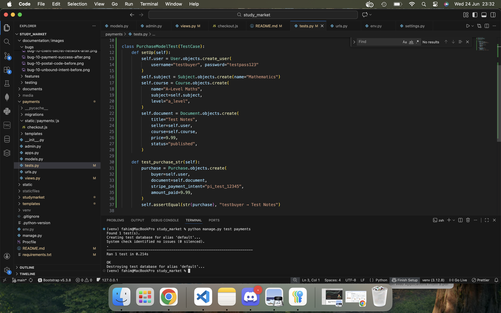 |
| `test_duplicate_purchase_prevented` | Attempting to create a duplicate Purchase for the same buyer and document raises an exception due to `unique_together` constraint | ✅ Pass | 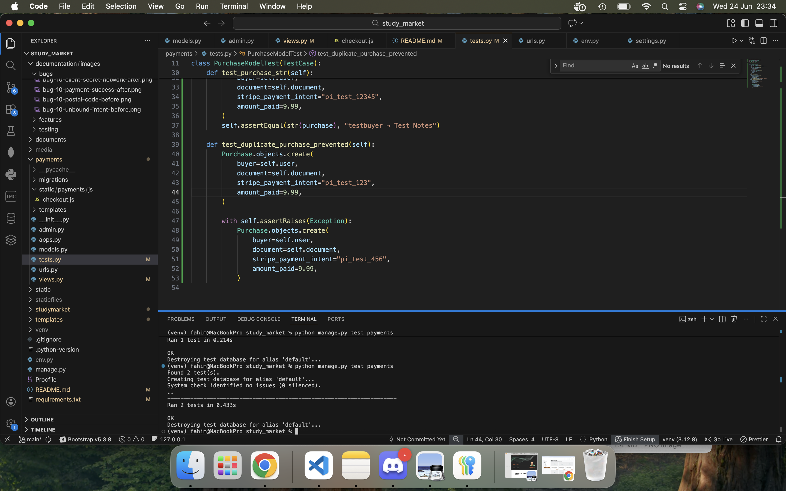 |
| `test_checkout_requires_login`      | Unauthenticated users attempting to access the checkout page are redirected to the login page with a 302 response                 | ✅ Pass |  |

## Reviews App Testing

| Test                                  | Description                                                                                              | Result  | Screenshot                                            |
| ------------------------------------- | -------------------------------------------------------------------------------------------------------- | ------- | ----------------------------------------------------- |
| `test_review_str`                     | Review `__str__` returns correct format `reviewer — document title (rating★)`                            | ✅ Pass | 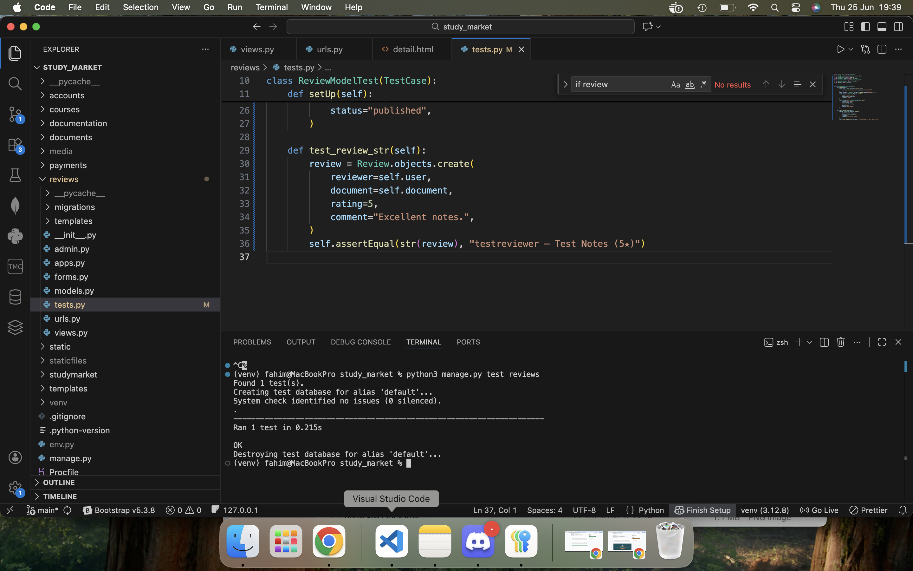 |
| `test_unpurchased_user_cannot_review` | A user who has not purchased a document is redirected away from the review form and no review is created | ✅ Pass | 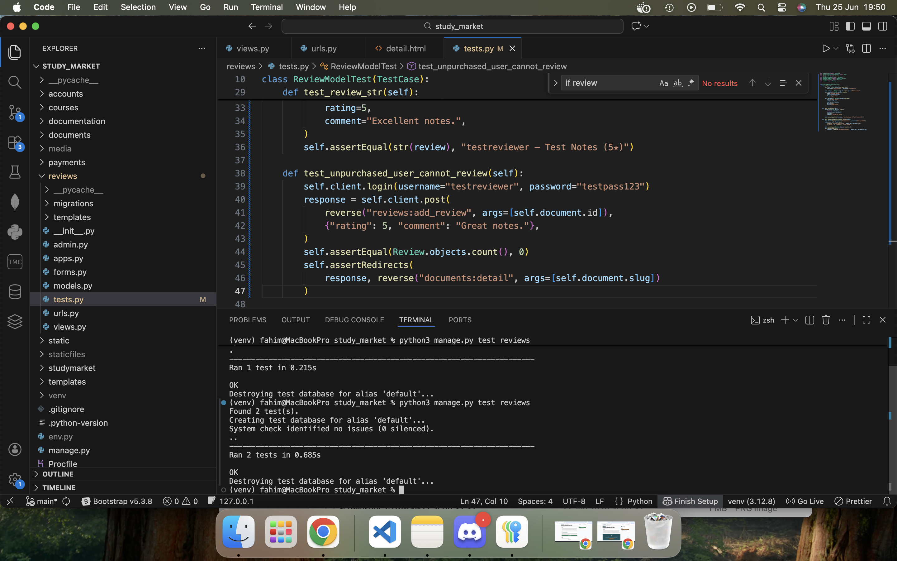 |
| `test_purchased_user_can_review`      | A user who has purchased a document can successfully submit a review which is saved to the database      | ✅ Pass | 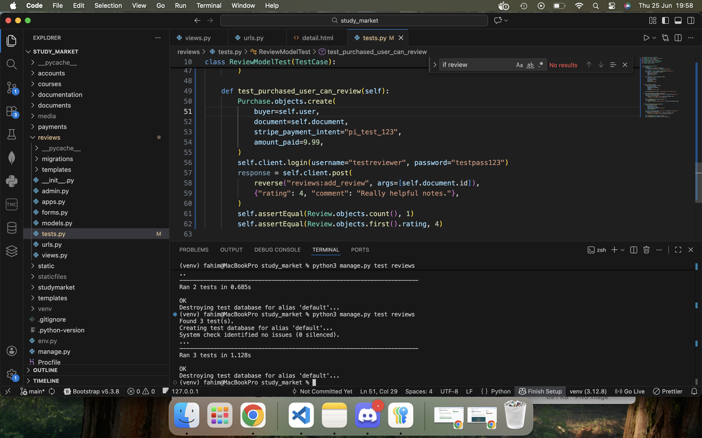 |

### Automated Testing

_(Test tables per app once tests are written.)_

### Manual Testing

_(User story → test → expected → actual → pass/fail table.)_

### Validator Testing

#### HTML Validation

#### CSS Validation

#### Python PEP8 Validation

#### JavaScript

#### Lighthouse

### Responsiveness

_(Chrome / Safari / Firefox × Desktop / Tablet / Mobile.)_

---

## Bugs

### Bug 1 — Heroku push rejected: no default language detected

- **Issue:** `git push heroku main` was rejected with "No default language could be detected for this app", even though `requirements.txt` existed in the repository.
- **Root cause:** Two compounding problems. First, no buildpack had been explicitly set on the Heroku app. Second — and the real culprit — the local git repository's root (`.git` folder) was sitting one level above the actual project folder (`~/Desktop` instead of `~/Desktop/study_market`), so every tracked file was nested under an extra `study_market/` prefix in the repo. Heroku was therefore looking for `requirements.txt` at the repo root and not finding it, since it was actually one directory deeper.
- **Fix:**
  1. Explicitly set the buildpack: `heroku buildpacks:set heroku/python`
  2. Moved the `.git` folder into the correct project directory so the repo root matches the project root: `mv ~/Desktop/.git ~/Desktop/study_market/.git`
  3. Restaged and committed the resulting path changes so all files (`manage.py`, `requirements.txt`, etc.) sit at the top level of the repository.

```bash
heroku buildpacks:set heroku/python
mv ~/Desktop/.git ~/Desktop/study_market/.git
cd ~/Desktop/study_market
git add -A
git commit -m "Fix repository root to match project structure"
git push origin main
git push heroku main
```

---

### Bug 2 — Invalid Python version in runtime.txt

- **Issue:** After fixing Bug 1, the build reached the Python detection step but failed with "Invalid Python version in runtime.txt".
- **Root cause:** `runtime.txt` is Heroku's older, now-deprecated method for pinning a Python version. Heroku's current buildpack expects a `.python-version` file instead, containing only the major version number (no `python-` prefix, no patch version).
- **Fix:** Removed `runtime.txt` and replaced it with `.python-version` containing just the major version.

\*\*Before 
\*\*After 

### Bug 3 — collectstatic failed: STATIC_ROOT not set

- **Issue:** After fixing Bugs 1 and 2, the Heroku build progressed further but then failed during the automatic `python manage.py collectstatic --noinput` step, raising `django.core.exceptions.ImproperlyConfigured: You're using the staticfiles app without having set the STATIC_ROOT setting to a filesystem path.`
- **Root cause:** `STATIC_ROOT` had never been added to `settings.py`. In development, Django's dev server serves static files automatically and doesn't need this setting, so the omission only surfaced once `DEBUG=False` and Heroku's build pipeline tried to gather all static files into a single deployable folder.
- **Fix:** Added `STATIC_ROOT` pointing at a `staticfiles` folder, and configured Whitenoise's compressed manifest storage backend so static files are served efficiently in production. Also confirmed `whitenoise.middleware.WhiteNoiseMiddleware` was present in `MIDDLEWARE`, directly after `SecurityMiddleware`.
  **Before (`settings.py`):**

```python
STATIC_URL = 'static/'
```

**After (`settings.py`):**

```python
STATIC_URL = 'static/'
STATIC_ROOT = BASE_DIR / 'staticfiles'

STORAGES = {
    "staticfiles": {
        "BACKEND": "whitenoise.storage.CompressedManifestStaticFilesStorage",
    },
}
```

```bash
python manage.py check
python manage.py collectstatic --noinput
git add studymarket/settings.py
git commit -m "Configure STATIC_ROOT and Whitenoise for static file serving"
git push origin main
git push heroku main
```

- **Screenshot:** 

### Bug 4 — Test database errors against hosted Postgres (Neon)

- **Issue:** Running `python manage.py test accounts` passed the actual test, but then crashed during teardown with `psycopg2.errors.ObjectInUse: database "test_neondb" is being accessed by other users`. Re-running the command afterwards then failed even earlier with `database "test_neondb" already exists`.

```bash
Destroying test database for alias 'default'...
Traceback (most recent call last):
...
File "/Users/fahim/Desktop/study_market/venv/lib/python3.12/site-packages/django/db/backends/utils.py", line 103, in \_execute
return self.cursor.execute(sql)
^^^^^^^^^^^^^^^^^^^^^^^^
django.db.utils.OperationalError: database "test_neondb" is being accessed by other users
DETAIL: There is 1 other session using the database.

======================================================================

Got an error creating the test database: database "test_neondb" already exists
Type 'yes' if you would like to try deleting the test database 'test_neondb', or 'no' to cancel: yes
Destroying old test database for alias 'default'...
Got an error recreating the test database: database "test_neondb" is being accessed by other users
DETAIL: There is 1 other session using the database.
```

- **Root cause:** Django's test runner creates a throwaway test database and destroys it after the run. Neon's connection pooling keeps a session open against the database in a way that blocks Postgres from dropping it, so the teardown step fails and leaves a stale `test_neondb` behind, which then blocks the next run from creating a fresh one.
- **Fix:** Routed test runs to a local SQLite database instead of Neon, since hosted Postgres connection pooling isn't well suited to the repeated create/destroy cycle of Django's test runner. The production/development database configuration is untouched — this only applies when the `test` management command is running.
  **Added to `settings.py`, directly after the `DATABASES` block:**

```python
# When running tests, use a local SQLite database instead of the
# Neon Postgres instance. Hosted Postgres connection pooling can hold
# onto sessions in a way that conflicts with Django's test runner
# repeatedly creating/destroying a throwaway test database.
if 'test' in sys.argv:
    DATABASES['default'] = {
        'ENGINE': 'django.db.backends.sqlite3',
        'NAME': BASE_DIR / 'test_db.sqlite3',
    }
```

`test_db.sqlite3` was also added to `.gitignore`, alongside the existing `db.sqlite3` entry.

### Bug 5 — Heroku release command failed: missing login_view function

- **Issue:** `git push heroku main` built and deployed successfully, but the automatic `release: python manage.py migrate` step then failed with `AttributeError: module 'accounts.views' has no attribute 'login_view'`, and the release was rejected.
- **Root cause:** `accounts/urls.py` referenced `views.login_view`, but a custom `login_view` function had not yet been written in `accounts/views.py` at the time of that commit — only the route was added, not the view itself. This passed local testing because the dev server hadn't been restarted to pick up the missing reference, but Heroku's release phase runs `manage.py check` fresh on every deploy, which immediately caught the broken import.
- **Fix:** Added the missing `login_view` function to `accounts/views.py`, handling both the GET (render empty form) and POST (validate credentials, log in, redirect) cases using Django's built-in `AuthenticationForm`.
- **Note on safety:** Because the release command failed, Heroku did not switch traffic to the broken release — the previous working version stayed live throughout. This confirmed the value of the `release` phase running checks _before_ a deploy goes live, rather than after.

```bash
python manage.py check
python manage.py runserver
# confirm /accounts/login/ works locally before pushing again
git add accounts/views.py accounts/urls.py
git commit -m "Fix missing login_view function"
git push origin main
git push heroku main
```

- **Screenshot:** 

### Bug 6 — Custom CSS not applying: missing STATICFILES_DIRS

- **Issue:** The site rendered with default Bootstrap colours instead of the custom teal/orange design system palette defined in `static/css/style.css`, even though Bootstrap itself loaded correctly and `style.css` had the right content.
- **Root cause:** `STATICFILES_DIRS` was missing from `settings.py`. `STATIC_ROOT` only defines where `collectstatic` _outputs_ files for production — it does not tell Django where to _find_ source static files during development. Without `STATICFILES_DIRS` pointing at the project's `static/` folder, Django had no way to locate `style.css` at all, confirmed by `python manage.py findstatic css/style.css` returning "No matching file found."
- **Fix:** Added `STATICFILES_DIRS = [BASE_DIR / "static"]` to `settings.py`, alongside the existing `STATIC_URL` and `STATIC_ROOT` settings.
  **Before:**

```python
STATIC_URL = "static/"
STATIC_ROOT = BASE_DIR / "staticfiles"
```

**After:**

```python
STATIC_URL = "static/"
STATICFILES_DIRS = [BASE_DIR / "static"]
STATIC_ROOT = BASE_DIR / "staticfiles"
```

```bash
python manage.py findstatic css/style.css
python manage.py check
git add studymarket/settings.py
git commit -m "Fix missing STATICFILES_DIRS so custom CSS is found"
git push origin main
git push heroku main
```

- **Before:** 
- **After:** 

### Bug 7 — InvalidStorageError: missing 'default' key in STORAGES

- **Issue:** Attempting to save a `Document` with a file upload in Django admin crashed with `django.core.files.storage.handler.InvalidStorageError: Could not find config for 'default' in settings.STORAGES`.
- **Root cause:** The `STORAGES` setting in `settings.py` only defined the `staticfiles` backend (for Whitenoise), but Django's `FileField` on the `Document` model also requires a `default` backend to know where to store uploaded media files. Without it, any attempt to save a file upload crashes immediately.
- **Note:** This was also the likely root cause of the unexplained 500 error on `/accounts/login/` in production — the missing `default` storage key would crash any page rendering a file field, even just displaying a form.
- **Fix:** Added the `default` key to `STORAGES` and confirmed `MEDIA_URL` and `MEDIA_ROOT` were set correctly.

**Before (`settings.py`):**

```python
STORAGES = {
    "staticfiles": {
        "BACKEND": "whitenoise.storage.CompressedManifestStaticFilesStorage",
    },
}
```

**After (`settings.py`):**

```python
STORAGES = {
    "default": {
        "BACKEND": "django.core.files.storage.FileSystemStorage",
    },
    "staticfiles": {
        "BACKEND": "whitenoise.storage.CompressedManifestStaticFilesStorage",
    },
}
```

- **Before:** 
- **After:** 

### Bug 8: `` placed before `` in checkout template

**Issue:** `TemplateSyntaxError` at `/payments/checkout/242/` when navigating to the checkout page. Django threw the error: ` must be the first tag in 'payments/checkout.html'`, preventing the page from rendering entirely.


**Cause:** When separating the Stripe JavaScript into a static file, `` was added to the top of `checkout.html` on line 1, pushing `` down to line 2. Django's template engine requires `` to be the absolute first tag in any template that inherits from a base template — nothing can precede it, including `` tags.

**Fix:** Swapped the order so `` appears on line 1 and `` appears on line 2. Django processes `` before anything else, so `` works correctly when placed after it.


### Bug 9: Footer not sticking to bottom of page on short pages

**Issue:** On pages with little content such as the checkout page, the footer floated halfway up the screen leaving a large blank gap below it.


**Cause:** The `body` element had no minimum height set, so on pages where the content didn't fill the viewport, the footer would render immediately after the content rather than at the bottom of the page.

**Fix:** Added `min-height: 100vh` and `display: flex; flex-direction: column` to the `body` in `style.css`, and `flex: 1` to the `main` element. This forces the main content area to expand and fill all available space, pushing the footer to the bottom regardless of content length.


### Bug 10: Checkout page throwing UnboundLocalError and payment not completing

Three related issues prevented the payment flow from working end to end. Each was identified and fixed in sequence.

---

**Issue 1 — UnboundLocalError on GET request**

When navigating to the checkout page, Django threw an `UnboundLocalError: cannot access local variable 'intent' where it is not associated with a value` at `payments/views.py line 33`.

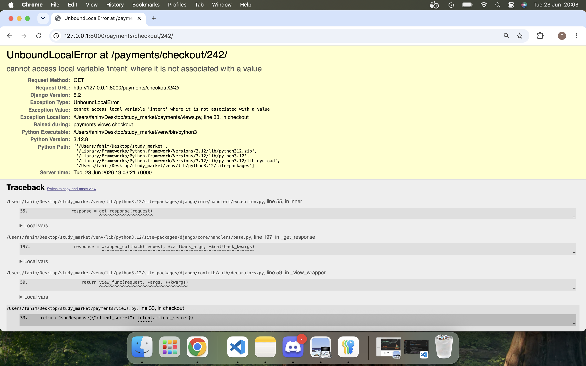

**Cause:** The `return JsonResponse` statement had been accidentally placed outside the `if request.method == "POST"` block. On a GET request, `intent` is never created because the Stripe API is only called on POST, so Python raised an error when trying to access `intent.client_secret`.

```python
# Broken — JsonResponse outside the POST block
if request.method == "POST":
    intent = stripe.PaymentIntent.create(...)
return JsonResponse({"client_secret": intent.client_secret})
```

**Fix:** Moved `return JsonResponse` inside the POST block and added a `return render` for GET requests so the checkout page renders correctly on first load.

```python
# Fixed
if request.method == "POST":
    intent = stripe.PaymentIntent.create(...)
    return JsonResponse({"client_secret": intent.client_secret})

return render(request, "payments/checkout.html", {
    "document": document,
    "stripe_public_key": settings.STRIPE_PUBLIC_KEY,
})
```

---

**Issue 2 — Postal code field blocking payment**

After fixing Issue 1, the checkout page rendered correctly but the Stripe card element showed a postal code field that only accepted numeric digits. UK postcodes contain letters so the field could never be completed, blocking payment.

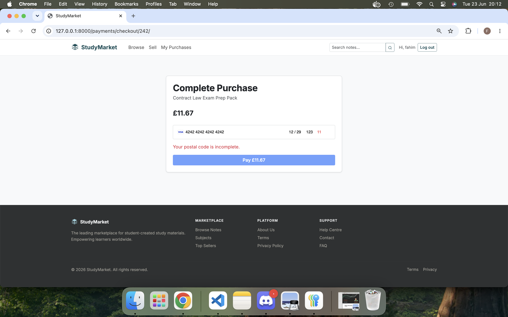

**Cause:** Stripe's card element defaults to US postal code format (5 numeric digits). Setting `locale: 'en-GB'` did not resolve the issue.

**Fix:** Added `hidePostalCode: true` to the card element options in `checkout.js` to remove the field entirely, as postal code validation is not required for test payments.

```javascript
// Before
const card = elements.create("card");

// After
const card = elements.create("card", {
  hidePostalCode: true,
});
```

---

**Issue 3 — client_secret not being passed to Stripe**

After fixing Issues 1 and 2, clicking Pay produced no visible response. The browser console showed `IntegrationError: Invalid value for stripe.confirmCardPayment intent secret: value should be a client secret of the form ${id}_secret_${secret}. You specified: .`

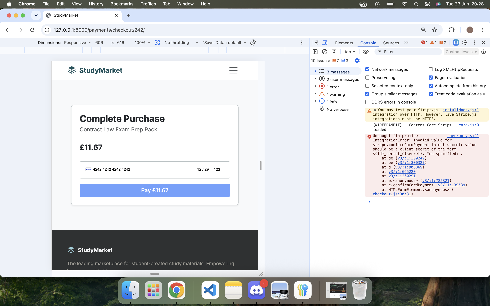

The Network tab confirmed the POST request was returning 200 OK with the correct JSON including a valid `client_secret`.

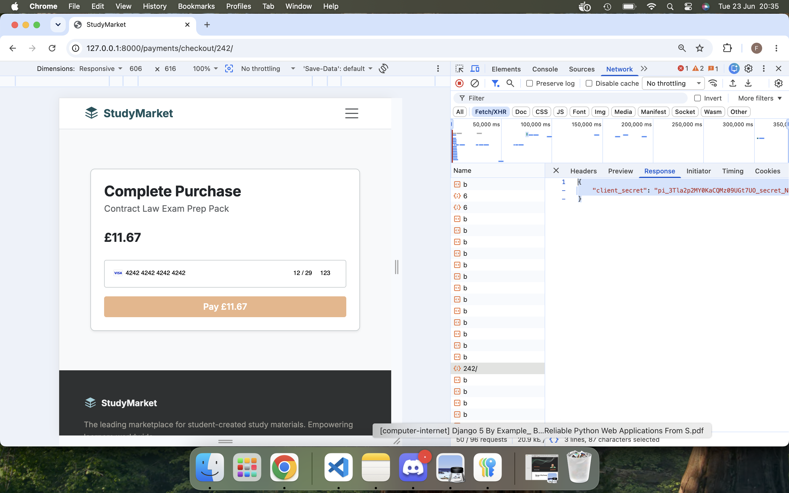

**Cause:** The JS was reading `clientSecret` from the `data-client-secret` HTML attribute set at page load. However this attribute is empty on GET because no PaymentIntent exists until the form is submitted. The `client_secret` was being fetched correctly via POST but the JS was ignoring it and using the empty attribute value instead.

```javascript
// Broken — using empty data attribute from page load
const result = await stripe.confirmCardPayment(clientSecret, {
  payment_method: { card: card },
});
```

**Fix:** Changed the JS to use `data.client_secret` from the POST response, which contains the actual PaymentIntent secret returned by the checkout view.

```javascript
// Fixed — using client_secret from POST response
const data = await response.json();
const result = await stripe.confirmCardPayment(data.client_secret, {
  payment_method: { card: card },
});
```

After all three fixes the payment flow completed successfully, the success page rendered, and the Purchase record was confirmed in the database.

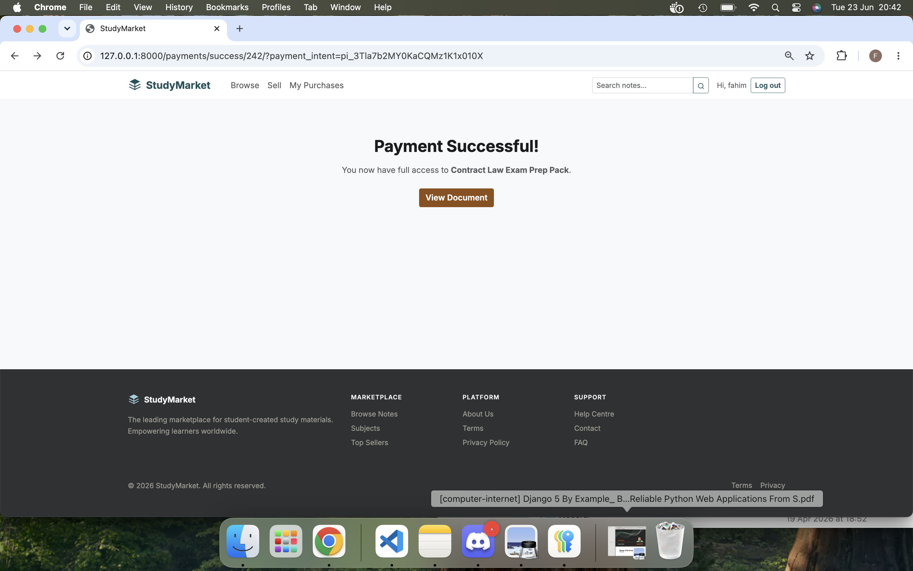

### Bug 11: Incorrect field name `title` used in payments test setUp

**Cause:** `Course` model uses `name` not `title`. The error was caught by the test runner.

**Fix:** Changed `title='A-Level Maths'` to `name='A-Level Maths'` in `payments/tests.py` setUp.

### Bug 12: Footer missing on deployed Heroku site

**Issue:** The footer was visible locally but completely absent on the live Heroku deployment. Inspecting the page source on Heroku confirmed the footer HTML was not being rendered — after `</main>` the page went straight to the Bootstrap `<script>` tag and `</body>`, with no footer element present.

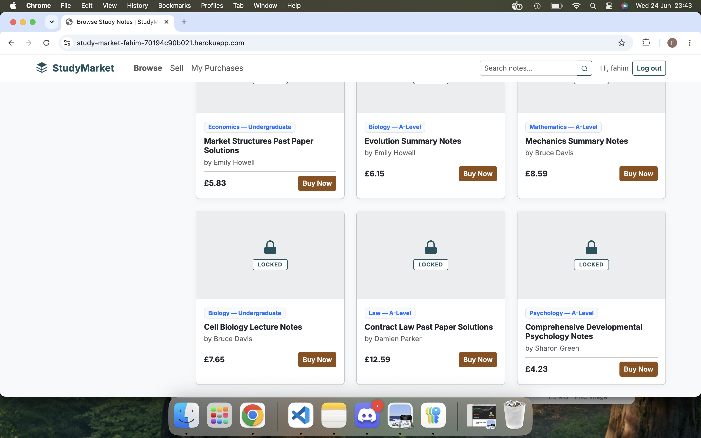

**Cause:** The `` line had been added to `templates/base.html` locally but was never staged and committed to git. Because Heroku deploys from the git repository rather than the local file system, it was running with the older version of `base.html` that had no footer include. The file looked correct locally because the working directory had the change, but `git show HEAD:templates/base.html` confirmed the committed version did not contain the footer include line.

```bash
# Confirmed footer include was missing from committed base.html
git show HEAD:templates/base.html | grep footer
# returned nothing
```

**Fix:** Staged and committed `templates/base.html` with the footer include in place, then pushed to both GitHub and Heroku.

```html
<!-- Added to base.html before the closing </body> tag -->

```

After deploying, the footer rendered correctly on the live site.

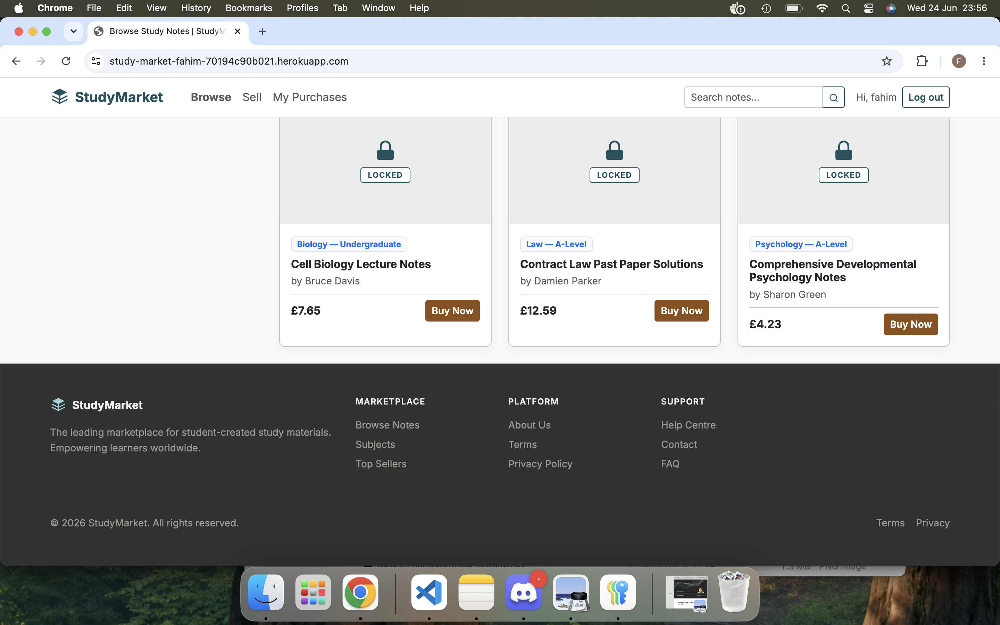

### Bug 13: Reviews section missing from document detail page

**Issue:** After deleting a review, the reviews section disappeared entirely from the document detail page — including the "Write a Review" button, meaning there was no way to add a new review.

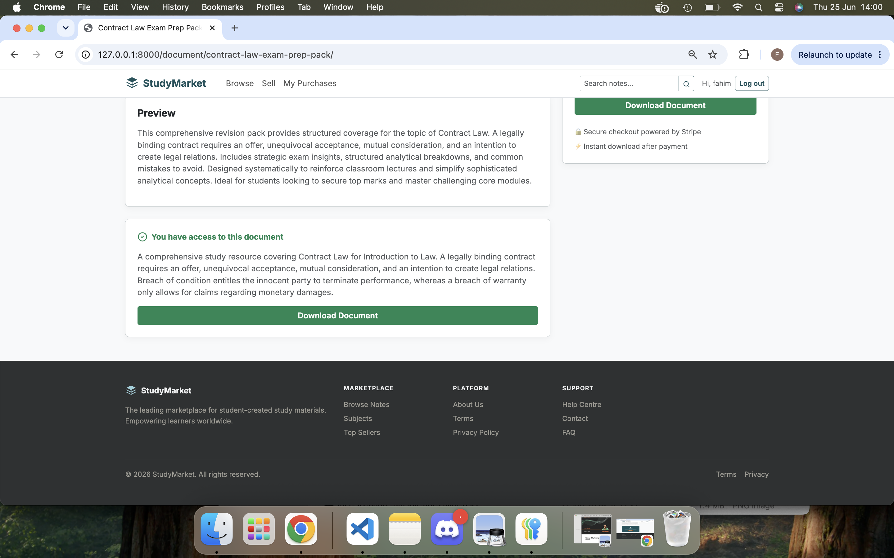

**Cause:** When the detail template was rewritten to wire up the checkout buttons, the reviews section lost its wrapping `<div class="card p-4 mb-4">` container and the `` block containing the "Write a Review" button. The `` loop remained but without the card wrapper or the button, leaving the section invisible when there were no reviews to iterate over.

**Fix:** Rewrote the reviews section with the correct structure — a card wrapper containing the reviews loop, a fallback "No reviews yet" message when the queryset is empty, and the "Write a Review" button rendered conditionally when the user has purchased the document but not yet left a review.

```html
<div class="card p-4 mb-4">
  <h2 class="h5 fw-bold mb-3">Reviews</h2>
    ...  
  <p class="text-muted mb-3">
    No reviews yet. Be the first to review this document.
  </p>
   
  <a
    href=""
    class="btn btn-outline-secondary mt-2"
  >
    Write a Review
  </a>
  
</div>
```

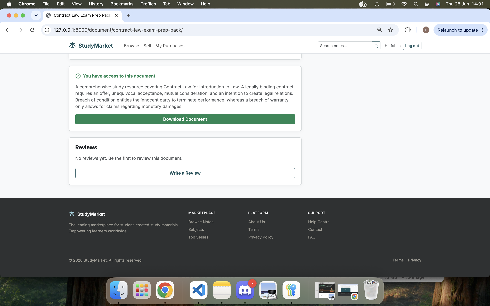

### Bug 14: Heroku 500 error on document detail page after reviews app added

**Issue:** After adding the `reviews` app, the live Heroku site threw a 500 Internal Server Error on all document detail pages while the local development server worked fine.

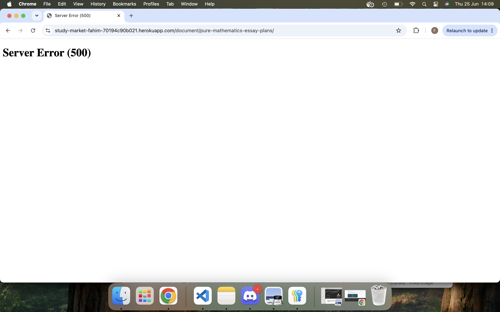

**Cause:** Several local changes had never been staged and committed to git, meaning Heroku was deploying an incomplete codebase. The missing changes were:

- `reviews` was added to `INSTALLED_APPS` locally but the updated `settings.py` was never committed, so Heroku did not know the `reviews` app existed. This caused Django to throw `RuntimeError: Model class reviews.models.Review doesn't declare an explicit app_label and isn't in an application in INSTALLED_APPS` every time the document detail view tried to import the `Review` model.
- `payments/views.py` had local changes not committed.
- `studymarket/urls.py` had the `reviews/` path added locally but not committed.
- `requirements.txt` had new packages not committed.

The Heroku release command was failing silently on each deploy attempt, leaving the dyno running the previous broken version of the code. This was confirmed by running `heroku releases:output v72` which showed the full traceback.

**Fix:** Ran `git status` which revealed the uncommitted files, then staged and committed all outstanding changes:

```bash
git add .
git commit -m "Commit any missed changes"
git push origin main
git push heroku main
```

After deploying, the document detail page loaded correctly on the live site.

**Prevention:** Always run `git status` before pushing to confirm no local changes have been left uncommitted. Each feature should be committed in its entirety before moving on.

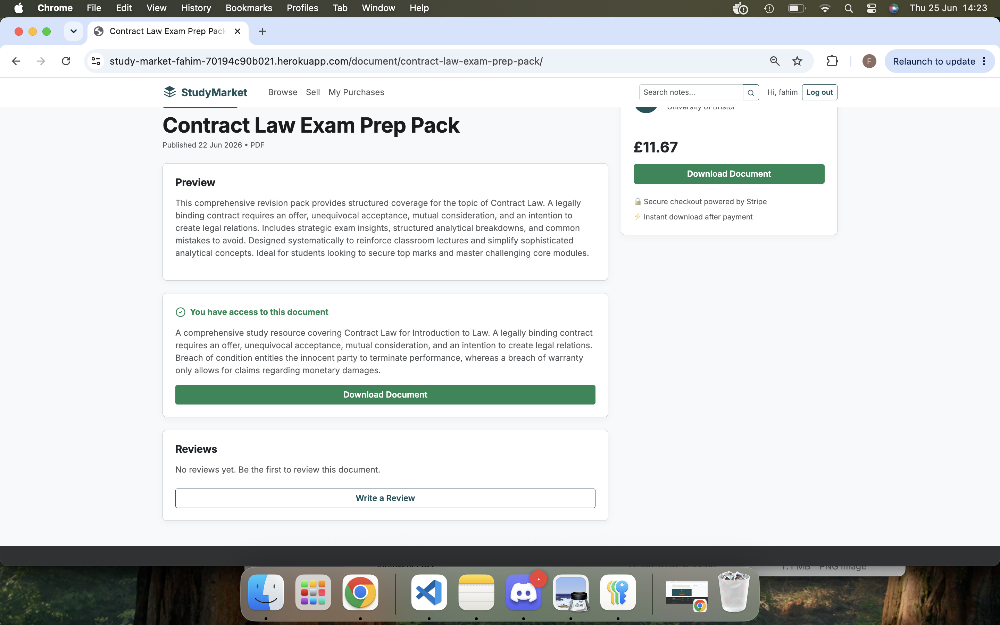

### Bug 15: Stripe publishable key not set on Heroku causing payments to fail

**Issue:** On the live Heroku site, clicking the "Unlock" button to purchase a document produced no visible response — the checkout page loaded correctly with the card element, but pressing Pay did nothing. Opening the browser developer console revealed the error: `Uncaught IntegrationError: Please call Stripe() with your publishable key. You used an empty string.`

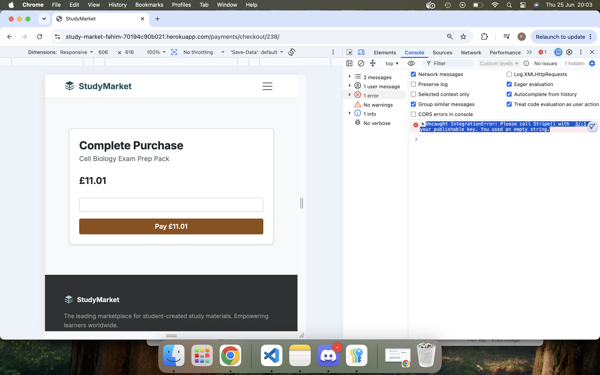

**Cause:** The `STRIPE_PUBLIC_KEY` environment variable had not been configured in Heroku's config vars. Locally, all environment variables are loaded from `env.py` at runtime. However `env.py` is listed in `.gitignore` and is never committed to the repository or deployed to Heroku — this is intentional for security reasons, as it contains secret keys. Without the variable being explicitly set in Heroku's config vars, `os.environ.get('STRIPE_PUBLIC_KEY', '')` in `settings.py` returned an empty string. This empty string was passed through the Django template context into the `data-public-key` attribute on the `div#stripe-data` element, which `checkout.js` then read and passed to `Stripe()` — causing Stripe's JS library to throw the integration error and refuse to initialise.

The issue only appeared on Heroku and not locally because the local `env.py` had the key correctly set. This is a common deployment gotcha with environment-variable-based configuration — every variable in `env.py` must also be manually set in Heroku's config vars.

During the fix, the Stripe secret key (`sk_test_...`) was accidentally entered as the value for `STRIPE_PUBLIC_KEY` instead of the publishable key (`pk_test_...`). This was caught immediately and corrected — the two keys serve different purposes: the publishable key is safe to expose in the frontend JS, while the secret key must never leave the server.

**Fix:** Set the correct Stripe publishable key in Heroku config vars using the CLI:

```bash
heroku config:set STRIPE_PUBLIC_KEY=pk_test_...
```

The value was confirmed with:

```bash
heroku config:get STRIPE_PUBLIC_KEY
```

After the dyno restarted with the correct key, the Stripe card element initialised correctly, the payment flow completed successfully, and the success page rendered on the live site.

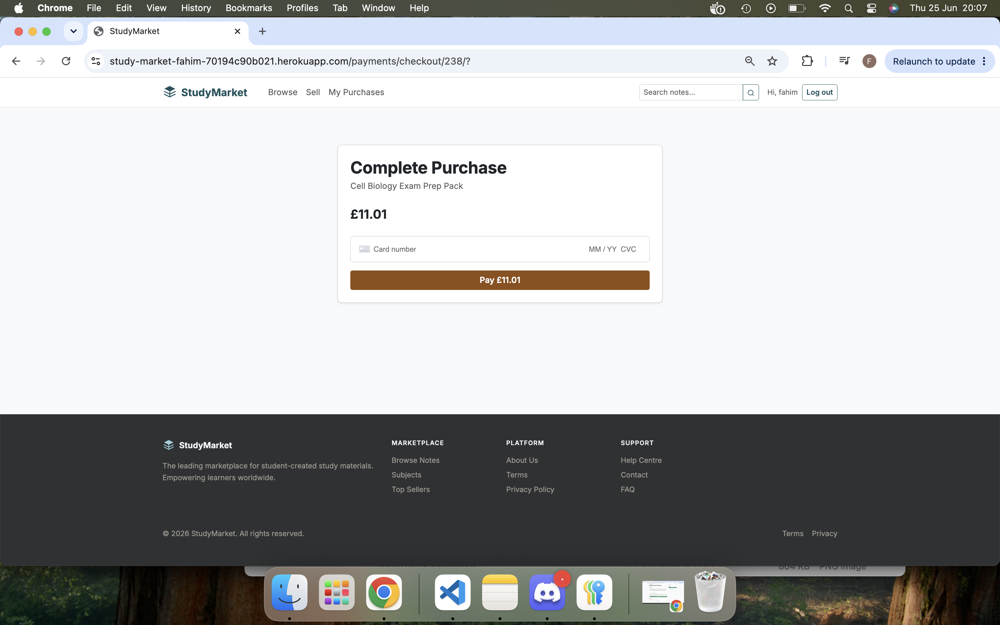

### Bug 16: Cloudinary `django-cloudinary-storage` incompatible with Django 5.2 causing Heroku build failure

**Issue:** After installing `cloudinary` and `django-cloudinary-storage` for media file persistence on Heroku, every subsequent deploy failed during the build process. The Heroku build log showed the error occurring during the automatic `python manage.py collectstatic --noinput` step:

```
AttributeError: 'Settings' object has no attribute 'STATICFILES_STORAGE'. Did you mean: 'STATICFILES_DIRS'?
Error: Unable to generate Django static files.
Push rejected, failed to compile Python app.
```

This meant no new code could be deployed to Heroku until the issue was resolved.

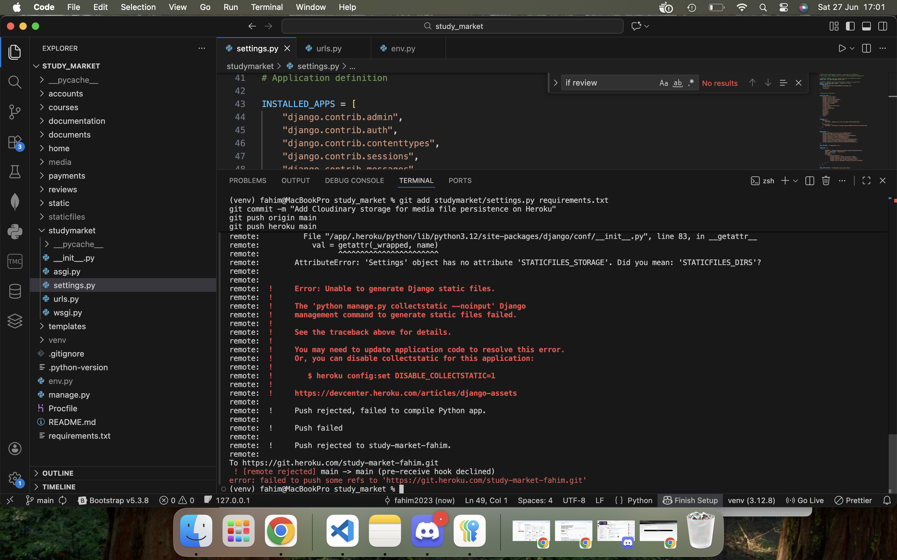

**Cause:** The `django-cloudinary-storage==0.3.0` package was written for older versions of Django that used `STATICFILES_STORAGE` as a top-level settings key to configure the static files storage backend. In Django 4.2, this key was deprecated in favour of the new `STORAGES` dictionary which consolidates both `DEFAULT_FILE_STORAGE` and `STATICFILES_STORAGE` into a single setting. By Django 5.2, `STATICFILES_STORAGE` was removed entirely from the framework.

The `django-cloudinary-storage` package's overridden `collectstatic` management command still contained a reference to `settings.STATICFILES_STORAGE` on line 27 of its source:

```python
if (settings.STATICFILES_STORAGE == 'cloudinary_storage.storage.StaticCloudinaryStorage' or
```

Since `STATICFILES_STORAGE` no longer exists as an attribute on the Django settings object in Django 5.2, Python raised an `AttributeError` every time Heroku ran `collectstatic` during the build, causing the entire build to fail and the push to be rejected.

An initial fix attempt of replacing `DEFAULT_FILE_STORAGE` with the new `STORAGES` dictionary in `settings.py` did not resolve the issue, because the problem was inside the third-party `django-cloudinary-storage` package itself — not in our project's settings. The package would need to be updated by its maintainers to support Django 5.2.

**Fix:** Since Whitenoise already handles static file serving reliably on Heroku, Cloudinary is only needed for user-uploaded media files (PDFs). There was no need for `django-cloudinary-storage` to intercept the `collectstatic` process at all. The fix was to disable Heroku's automatic `collectstatic` call by setting a config var:

```bash
heroku config:set DISABLE_COLLECTSTATIC=1
```

Static files continue to be collected locally and served by Whitenoise as before. Cloudinary handles only the media file storage backend via the `STORAGES` setting in `settings.py`:

```python
STORAGES = {
    "default": {
        "BACKEND": "cloudinary_storage.storage.MediaCloudinaryStorage",
    },
    "staticfiles": {
        "BACKEND": "whitenoise.storage.CompressedManifestStaticFilesStorage",
    },
}
```

After setting the config var and pushing again, the Heroku build succeeded and the application deployed correctly.

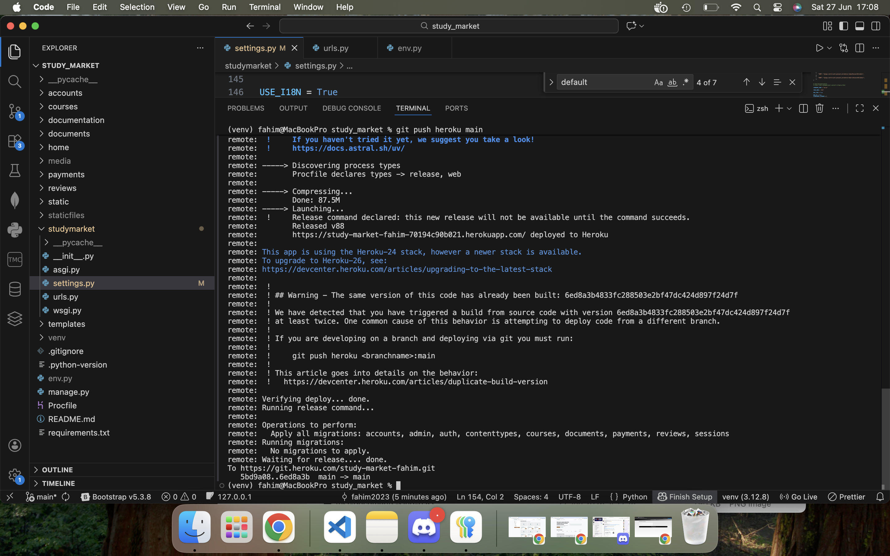

### Bug 17: NoReverseMatch on seller dashboard — edit and delete URLs not yet registered

**Issue:** After successfully uploading a document via the seller upload form, Django redirected to the seller dashboard at `/documents/seller/dashboard/`. The page immediately threw a `NoReverseMatch` error: `Reverse for 'edit' not found. 'edit' is not a valid view function or pattern name.` The dashboard was completely inaccessible.

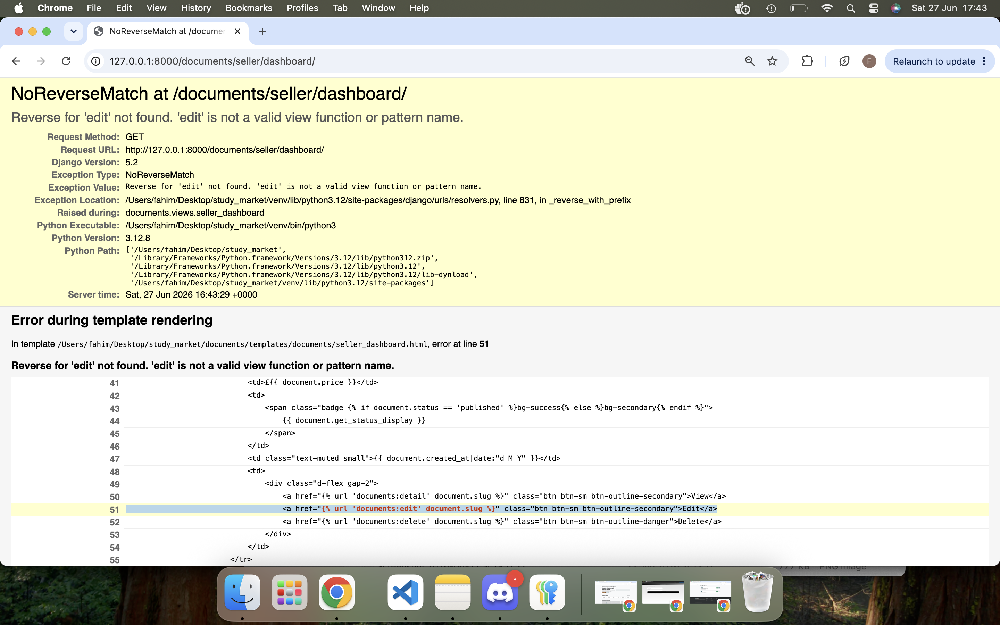

**Cause:** The `seller_dashboard.html` template was written in full, including Edit and Delete action buttons for each document row, before the corresponding `edit_document` and `delete_document` views and their URL patterns had been built. Django resolves all `` template tags at render time — if any named URL cannot be found in the URL configuration, it raises a `NoReverseMatch` exception immediately, preventing the entire page from rendering. The template contained:

```html
<a href="">Edit</a>
<a href="">Delete</a>
```

Neither `documents:edit` nor `documents:delete` existed in `documents/urls.py` at the time, causing the crash.

**Fix:** Temporarily removed the Edit and Delete buttons from `seller_dashboard.html`, leaving only the View button which correctly resolves to `documents:detail`. The edit and delete views, URLs and templates are being built as separate subsequent features. This restored the dashboard to a working state immediately.

---

### Bug 18: Upload page returning 404 at incorrect URL path

**Issue:** Attempting to navigate to `http://127.0.0.1:8000/seller/upload/` returned a 404 Page Not Found error. Django listed all registered URL patterns in the debug output and none of them matched `seller/upload/`.

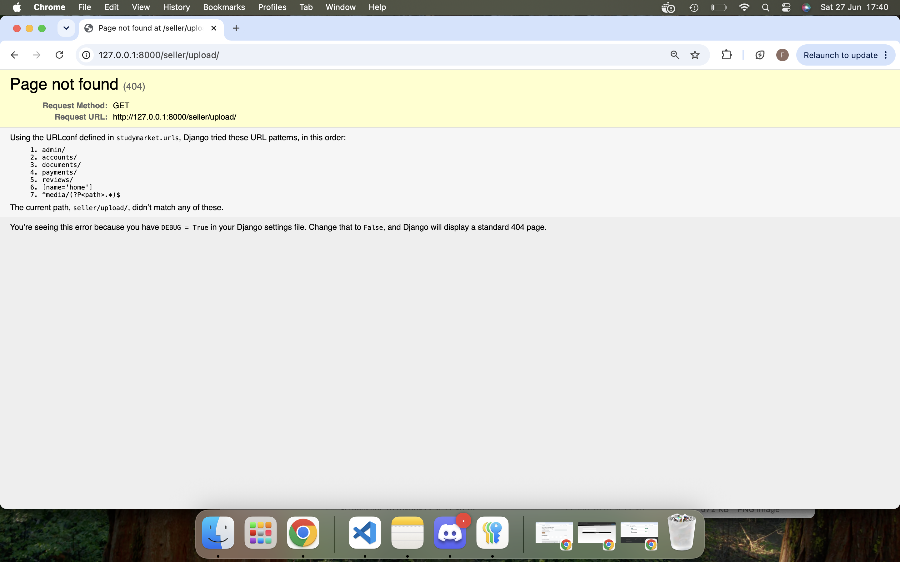

**Cause:** The upload view is registered inside `documents/urls.py`, which is itself included in the project URLs under the `documents/` prefix in `studymarket/urls.py`:

```python
path("documents/", include("documents.urls")),
```

This means all document URLs — including the upload page — are prefixed with `documents/`. The correct path is therefore `http://127.0.0.1:8000/documents/seller/upload/`, not `http://127.0.0.1:8000/seller/upload/`. The `documents/` prefix was being omitted when typing the URL directly into the browser.

**Fix:** Used the correct full URL path `http://127.0.0.1:8000/documents/seller/upload/`. All internal links in templates use `` which Django resolves correctly — this was purely a manual browser navigation error during testing.

---

### Bug 19: Cloudinary rejecting file uploads over 10MB with unhandled BadRequest exception

**Issue:** When attempting to upload a large PDF (57MB) via the seller upload form, Django threw an unhandled `BadRequest` exception with the message: `File size too large. Got 59705814. Maximum is 10485760. Upgrade your plan to enjoy higher limits`. The error page was shown to the user with no helpful feedback.

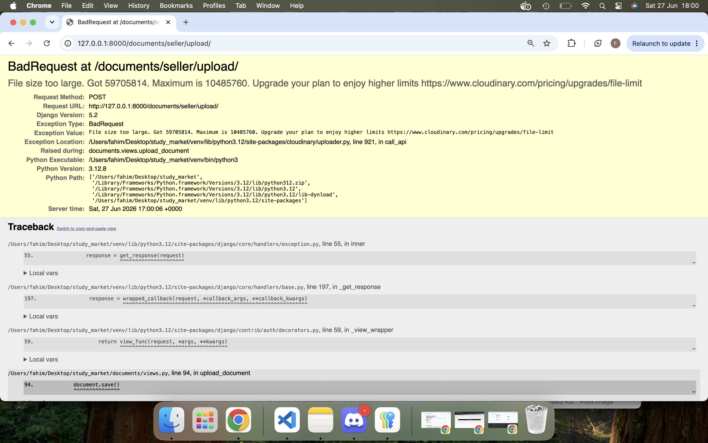

**Cause:** Cloudinary's free plan enforces a 10MB maximum file size per upload. The `DocumentForm` had no file size validation — it accepted any file regardless of size, passed it to Django's file handling pipeline, and only when the file was actually sent to Cloudinary's API did the size limit get enforced. At that point Cloudinary returned an error which Django raised as an unhandled `BadRequest` exception, crashing the view and showing the user the Django debug error page rather than a friendly validation message.

This is poor defensive design — the error should be caught before the file ever reaches Cloudinary, saving both the upload bandwidth and giving the user a clear, actionable message.

**Fix:** Added a `clean_file` method to `DocumentForm` in `documents/forms.py` that checks the file size before the form is considered valid. If the file exceeds 10MB, a `ValidationError` is raised and displayed to the user inline on the form:

```python
def clean_file(self):
    file = self.cleaned_data.get('file')
    if file and file.size > 10 * 1024 * 1024:
        raise forms.ValidationError(
            'File size must be under 10MB. Please compress your PDF and try again.'
        )
    return file
```

With this in place, oversized files are rejected at form validation before any Cloudinary API call is made, and the user sees a clear error message on the upload form explaining the limit and what to do.

### Bug 20: Login redirecting to browse page instead of homepage

**Issue:** After logging in, users were being redirected to `/documents/browse/` instead of the homepage at `/`. This was inconsistent with the intended user experience — new users logging in for the first time should land on the homepage which explains the platform, not be dropped straight into the document grid.

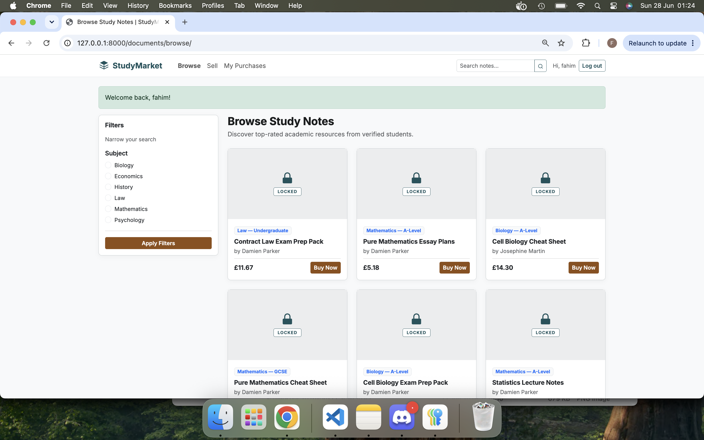

**Cause:** The `login_view` in `accounts/views.py` had a hardcoded `redirect("documents:browse")` on both the authenticated user check and the successful login path:

```python
def login_view(request):
    if request.user.is_authenticated:
        return redirect("documents:browse")  # hardcoded

    if request.method == "POST":
        form = AuthenticationForm(request, data=request.POST)
        if form.is_valid():
            user = form.get_user()
            auth_login(request, user)
            messages.success(request, f"Welcome back, {user.username}!")
            return redirect("documents:browse")  # hardcoded
```

This overrode the `LOGIN_REDIRECT_URL = 'home:home'` setting in `settings.py` entirely. Django's `LOGIN_REDIRECT_URL` setting is only used by the built-in authentication views — since we wrote a custom `login_view`, the setting had no effect and the hardcoded redirect in the view took precedence.

**Fix:** Updated both redirect calls in `accounts/views.py` to point to `home:home` instead of `documents:browse`:

```python
def login_view(request):
    if request.user.is_authenticated:
        return redirect("home:home")

    if request.method == "POST":
        form = AuthenticationForm(request, data=request.POST)
        if form.is_valid():
            user = form.get_user()
            auth_login(request, user)
            messages.success(request, f"Welcome back, {user.username}!")
            return redirect("home:home")
```

After the fix, logging in correctly redirects users to the homepage.

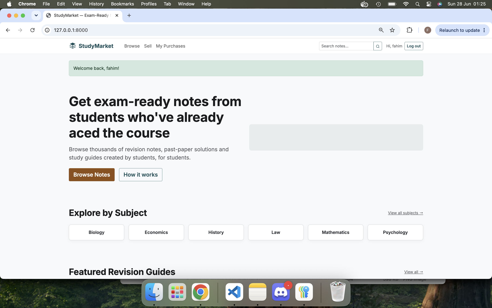
_(Each bug: issue, fix, before/after code, screenshot — added as they're hit and resolved.)_

---

## Future Implementations

- ***

## Credits

### Content

### Media

### Design Tools

### Code

_(Attribution for any external tutorials, docs, or library references used — required by the assignment spec.)_

### Tools & Platforms

### Acknowledgements
