# StudyMarket

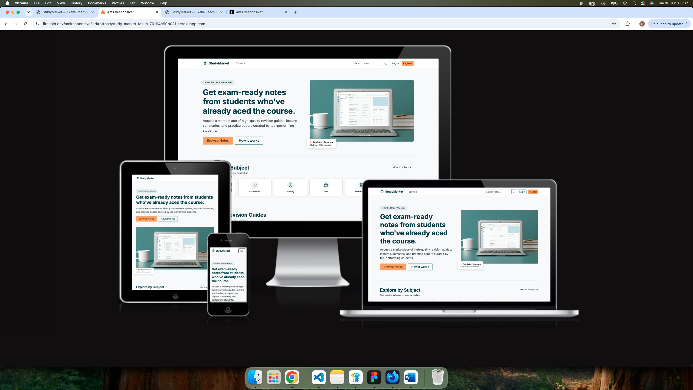

[StudyMarket](#) is a full-stack academic marketplace built with Django, where students buy and sell revision notes, past-paper solutions and study guides. Free users can preview a teaser of each document; the full content unlocks immediately after a secure Stripe payment.

[Click here to view the deployed site.](#)

[View the GitHub Repository](#)

---

## Table of Contents

- [Project Purpose](#project-purpose)
  - [Rationale](#rationale)
  - [Target Audience](#target-audience)
  - [Data Domain](#data-domain)
  - [Development Approach](#development-approach)
- [User Experience (UX)](#user-experience-ux)
  - [Goals and Objectives](#goals-and-objectives)
  - [User Stories](#user-stories)
  - [Wireframes](#wireframes)
- [Database Design](#database-design)
  - [ERD](#erd)
  - [Database Schema](#database-schema)
- [UI Design](#ui-design)
  - [Colour Scheme](#colour-scheme)
  - [Typography](#typography)
  - [Imagery](#imagery)
- [Features](#features)
- [Technologies Used](#technologies-used)
- [Security Features](#security-features)
- [Deployment](#deployment)
- [Testing](#testing)
  - [Automated Testing](#automated-testing)
  - [Manual Testing](#manual-testing)
  - [Validator Testing](#validator-testing)
  - [Responsiveness](#responsiveness)
- [Bugs](#bugs)
- [Future Implementations](#future-implementations)
- [Credits](#credits)

---

## Project Purpose

_(One paragraph: what the site does, the value for buyers, the value for sellers, the value for the site owner.)_

### Rationale

#### Background

_(The gap in the market this fills — why a peer-to-peer notes marketplace, not just a generic file host.)_

#### Purpose

_(Core purpose statement — should be immediately evident to a new visitor without documentation, per the assessment criteria.)_

### Target Audience

_(Buyers, sellers, admin — each with their own needs, mirroring the user stories below.)_

### Data Domain

_(Short description of the 8 models across 5 apps and how they relate — fuller detail goes in Database Design.)_

### Development Approach

_(Agile/incremental approach, GitHub Issues if used, TDD note, tech stack summary: Django, PostgreSQL, Stripe, Bootstrap 5, Heroku.)_

---

## User Experience (UX)

### Goals and Objectives

## **External user goals:**

## **Site owner goals:**

### User Stories

#### Visitor (not logged in)

| #   | User Story | Proof |
| --- | ---------- | ----- |

#### Buyer

| #   | User Story | Proof |
| --- | ---------- | ----- |

#### Seller

| #   | User Story | Proof |
| --- | ---------- | ----- |

#### Admin / Site Owner

| #   | User Story | Proof |
| --- | ---------- | ----- |

### Wireframes

_(Desktop/mobile wireframes per key page — Browse, Document Detail, Upload, Seller Dashboard, My Purchases.)_

---

## Database Design

### ERD

_(Entity Relationship Diagram image.)_

### Database Schema

| Model | Field | Type | Key | Notes |
| ----- | ----- | ---- | --- | ----- |

## **Relationships:**

---

## UI Design

The design system establishes a high-trust, structured environment for academic exchange, sitting at the intersection of minimalism and modern corporate design. The visual narrative prioritises clarity and utility so that study materials are easy to browse and digest, aiming to make the user feel organised, capable and prepared.

Three stylistic pillars guided every UI decision:

- **Functional Clarity** — generous whitespace and a rigorous grid
- **Academic Precision** — sharp typography and intentional use of borders
- **Approachable Utility** — softening the "institutional" feel with warm accents and human-centric micro-interactions

### Colour Scheme

A high-contrast palette distinguishes content navigation from transactional actions:

| Role      | Colour                               | Usage                                                                        |
| --------- | ------------------------------------ | ---------------------------------------------------------------------------- |
| Primary   | `#1A535C` (deep scholarly teal)      | Branding, headers, primary navigation — carries the "academic" weight        |
| Secondary | `#F4A261` (warm, sun-faded orange)   | Reserved exclusively for CTAs ("Buy", "Unlock", "Upload") and success states |
| Neutral   | `#F8F9FA` and surrounding cool greys | Background layering to reduce visual fatigue during long study sessions      |
| Error     | Standard red                         | Form/validation errors                                                       |
| Info      | Soft blue                            | Informational banners                                                        |

Borders throughout stay a crisp, low-opacity dark grey to define structure without adding visual bulk.

### Typography

**Inter** is the sole typeface across the whole site, chosen for maximum readability and a systematic, clean appearance.

- **Headlines** use tighter letter-spacing and bold weights to create strong hierarchy against body text
- **Body text** uses standard weight (400) with 1.5× line height, for comfortable reading of dense revision notes
- **Labels** use semibold weight with slight tracking to stay legible at small sizes (12–14px)
- **Mobile** headlines scale down by one tier to avoid awkward wrapping on small screens

### Layout, Spacing & Shape

- **Grid:** 12-column, 1280px max-width on desktop with 24px gutters; 4-column fluid grid with 16px margins on mobile
- **Spacing rhythm:** 4px/8px baseline — 24px for most component spacing, 40px for section breathing room
- **Corner radius:** 4px on standard elements (buttons, inputs, small cards), 8px on large containers, 12px on chips/status tags — a "soft" shape language balancing academic structure with marketplace approachability

### Elevation & Depth

Depth is built from low-contrast outlines and ambient shadows rather than heavy drop shadows — intended to feel like paper layered on a desk, not objects floating in space. Cards sit on a white background with a 1px border at rest, gain a subtle diffused shadow on hover (signalling interactivity), and modals/overlays use a more pronounced shadow to separate them from the page behind.

### Signature Component: Locked Content State

The single most important UI pattern on the site, since it's the visual proof of the payment-gating requirement: unpurchased document previews show a 4px backdrop blur over the content, with a centred lock icon and a "Purchase to Unlock" CTA in the secondary orange. This same locked/unlocked pairing is used consistently across the browse grid and the document detail page, so a user (or examiner) can immediately see the before/after of paying.

### Imagery

_(Source of any stock imagery used for hero/browse thumbnails, attribution — to confirm once final images are chosen.)_

---

## Features

### Navigation

### Homepage

### Browse & Filter

### Document Detail (Locked / Unlocked States)

### Upload Document

### Checkout (Stripe)

### Seller Dashboard

### My Purchases

### Reviews

### Admin Panel

_(Each gets a short description + screenshot once built.)_

---

## Technologies Used

## **Frontend:**

## **Backend:**

## **Database:**

## **Storage:**

## **Deployment:**

## **Development Tools:**

## **Validation Tools:**

## **Django Packages:**

---

## Security Features

_(Env vars, .gitignore, DEBUG handling, login_required, ownership checks, CSRF, password hashing, ORM/no direct DB access — fill in as each is implemented.)_

---

## Deployment

### Prerequisites

### Clone the Repository

```bash
git clone
cd study-market
```

### Local Development Setup

1.
2.
3.

### Deploy to Heroku

1.
2.

### Static & Media Files

_(Whitenoise for static; media file storage solution TBD — likely Cloudinary, since Heroku's filesystem isn't persistent.)_

---

## Testing

### Automated Testing

All automated tests use Django's built-in testing framework. Tests run against a local SQLite database rather than the production Neon Postgres instance — hosted Postgres connection pooling conflicts with Django's test runner repeatedly creating/destroying a throwaway test database, so `settings.py` routes test runs to SQLite explicitly (see Bug 4 below).

#### accounts app

| Test                                                  | Description                                                                    | Result | Screenshot                                                                  |
| ----------------------------------------------------- | ------------------------------------------------------------------------------ | ------ | --------------------------------------------------------------------------- |
| `test_profile_created_automatically_on_user_creation` | A Profile is created automatically via signal when a new User registers        | Pass   | 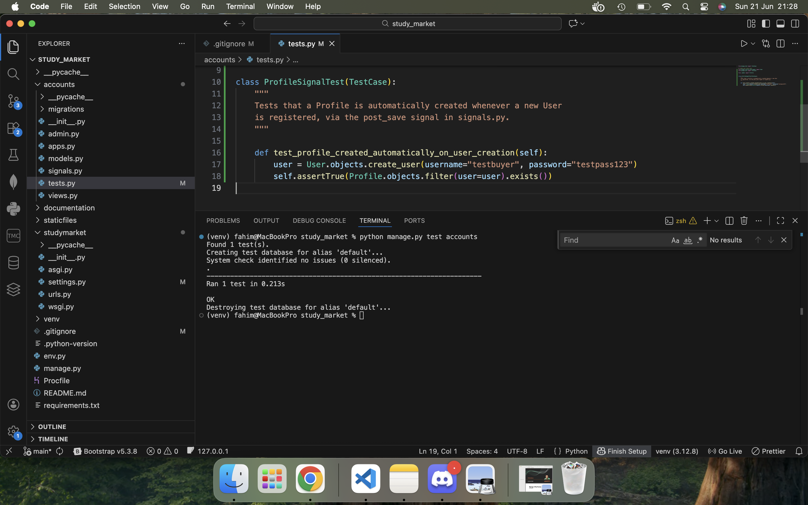    |
| `test_new_profile_defaults_to_not_a_seller`           | A newly created Profile defaults `is_seller` to False                          | Pass   | 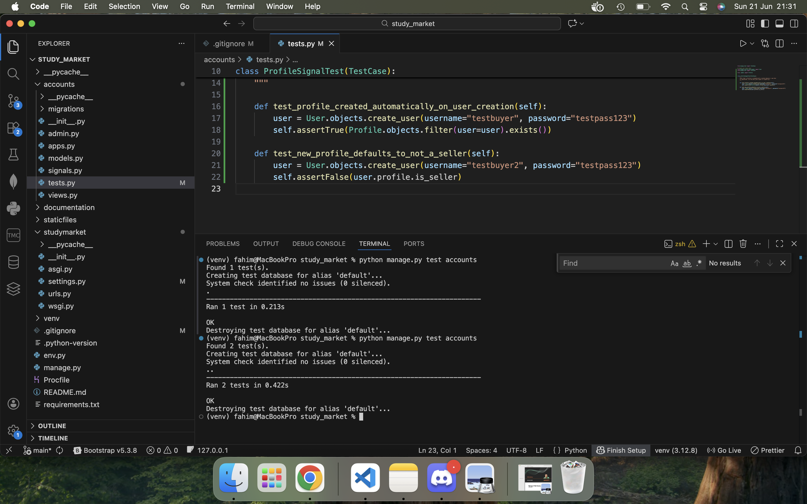 |
| `test_subject_slug_auto_generated`                    | Subject slug is auto-generated from the subject name on save                   | Pass   | 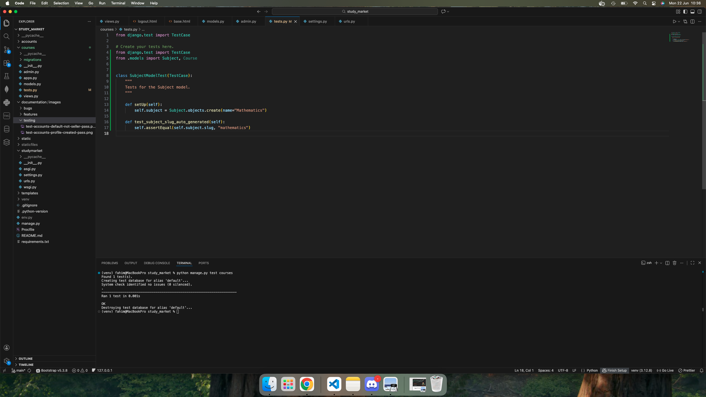        |
| `test_course_slug_auto_generated`                     | Course slug is auto-generated from subject name, course name and level on save | Pass   | 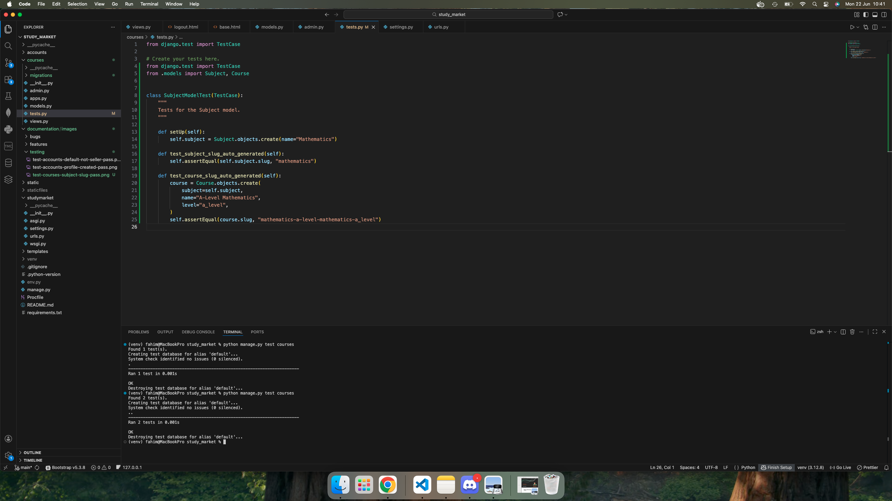         |
| `test_tag_str_returns_name`                           | DocumentTag string representation returns the tag name                         | Pass   | 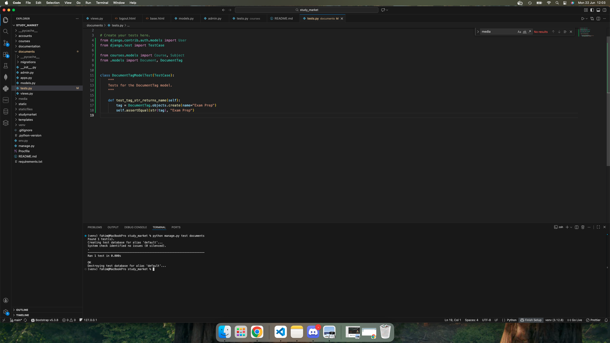           |
| `test_document_slug_auto_generated`                   | Document slug is auto-generated from the title on save                         | Pass   | 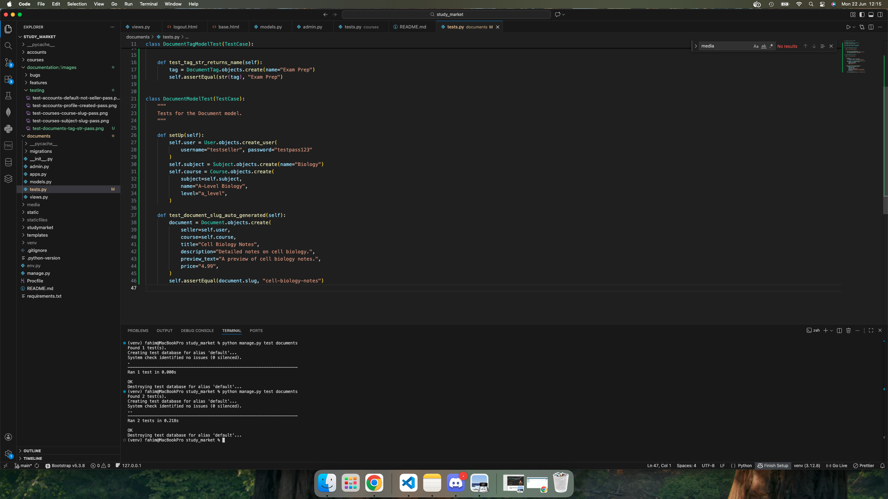              |

### Automated Testing

_(Test tables per app once tests are written.)_

### Manual Testing

_(User story → test → expected → actual → pass/fail table.)_

### Validator Testing

#### HTML Validation

#### CSS Validation

#### Python PEP8 Validation

#### JavaScript

#### Lighthouse

### Responsiveness

_(Chrome / Safari / Firefox × Desktop / Tablet / Mobile.)_

---

## Bugs

### Bug 1 — Heroku push rejected: no default language detected

- **Issue:** `git push heroku main` was rejected with "No default language could be detected for this app", even though `requirements.txt` existed in the repository.
- **Root cause:** Two compounding problems. First, no buildpack had been explicitly set on the Heroku app. Second — and the real culprit — the local git repository's root (`.git` folder) was sitting one level above the actual project folder (`~/Desktop` instead of `~/Desktop/study_market`), so every tracked file was nested under an extra `study_market/` prefix in the repo. Heroku was therefore looking for `requirements.txt` at the repo root and not finding it, since it was actually one directory deeper.
- **Fix:**
  1. Explicitly set the buildpack: `heroku buildpacks:set heroku/python`
  2. Moved the `.git` folder into the correct project directory so the repo root matches the project root: `mv ~/Desktop/.git ~/Desktop/study_market/.git`
  3. Restaged and committed the resulting path changes so all files (`manage.py`, `requirements.txt`, etc.) sit at the top level of the repository.

```bash
heroku buildpacks:set heroku/python
mv ~/Desktop/.git ~/Desktop/study_market/.git
cd ~/Desktop/study_market
git add -A
git commit -m "Fix repository root to match project structure"
git push origin main
git push heroku main
```

---

### Bug 2 — Invalid Python version in runtime.txt

- **Issue:** After fixing Bug 1, the build reached the Python detection step but failed with "Invalid Python version in runtime.txt".
- **Root cause:** `runtime.txt` is Heroku's older, now-deprecated method for pinning a Python version. Heroku's current buildpack expects a `.python-version` file instead, containing only the major version number (no `python-` prefix, no patch version).
- **Fix:** Removed `runtime.txt` and replaced it with `.python-version` containing just the major version.

\*\*Before 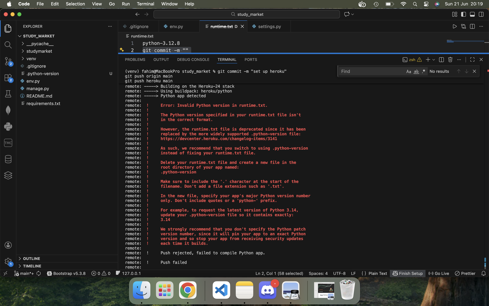
\*\*After 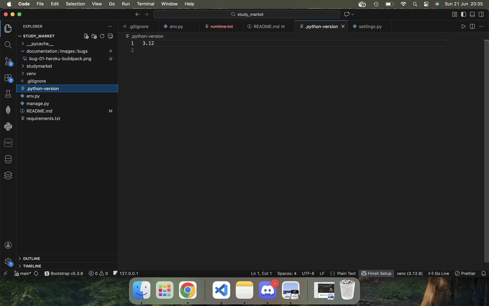

### Bug 3 — collectstatic failed: STATIC_ROOT not set

- **Issue:** After fixing Bugs 1 and 2, the Heroku build progressed further but then failed during the automatic `python manage.py collectstatic --noinput` step, raising `django.core.exceptions.ImproperlyConfigured: You're using the staticfiles app without having set the STATIC_ROOT setting to a filesystem path.`
- **Root cause:** `STATIC_ROOT` had never been added to `settings.py`. In development, Django's dev server serves static files automatically and doesn't need this setting, so the omission only surfaced once `DEBUG=False` and Heroku's build pipeline tried to gather all static files into a single deployable folder.
- **Fix:** Added `STATIC_ROOT` pointing at a `staticfiles` folder, and configured Whitenoise's compressed manifest storage backend so static files are served efficiently in production. Also confirmed `whitenoise.middleware.WhiteNoiseMiddleware` was present in `MIDDLEWARE`, directly after `SecurityMiddleware`.
  **Before (`settings.py`):**

```python
STATIC_URL = 'static/'
```

**After (`settings.py`):**

```python
STATIC_URL = 'static/'
STATIC_ROOT = BASE_DIR / 'staticfiles'

STORAGES = {
    "staticfiles": {
        "BACKEND": "whitenoise.storage.CompressedManifestStaticFilesStorage",
    },
}
```

```bash
python manage.py check
python manage.py collectstatic --noinput
git add studymarket/settings.py
git commit -m "Configure STATIC_ROOT and Whitenoise for static file serving"
git push origin main
git push heroku main
```

- **Screenshot:** 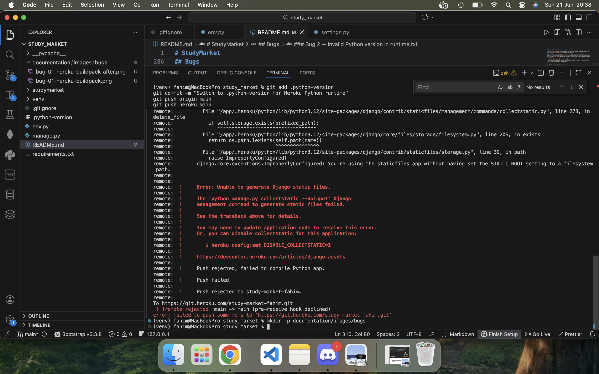

### Bug 4 — Test database errors against hosted Postgres (Neon)

- **Issue:** Running `python manage.py test accounts` passed the actual test, but then crashed during teardown with `psycopg2.errors.ObjectInUse: database "test_neondb" is being accessed by other users`. Re-running the command afterwards then failed even earlier with `database "test_neondb" already exists`.

```bash
Destroying test database for alias 'default'...
Traceback (most recent call last):
...
File "/Users/fahim/Desktop/study_market/venv/lib/python3.12/site-packages/django/db/backends/utils.py", line 103, in \_execute
return self.cursor.execute(sql)
^^^^^^^^^^^^^^^^^^^^^^^^
django.db.utils.OperationalError: database "test_neondb" is being accessed by other users
DETAIL: There is 1 other session using the database.

======================================================================

Got an error creating the test database: database "test_neondb" already exists
Type 'yes' if you would like to try deleting the test database 'test_neondb', or 'no' to cancel: yes
Destroying old test database for alias 'default'...
Got an error recreating the test database: database "test_neondb" is being accessed by other users
DETAIL: There is 1 other session using the database.
```

- **Root cause:** Django's test runner creates a throwaway test database and destroys it after the run. Neon's connection pooling keeps a session open against the database in a way that blocks Postgres from dropping it, so the teardown step fails and leaves a stale `test_neondb` behind, which then blocks the next run from creating a fresh one.
- **Fix:** Routed test runs to a local SQLite database instead of Neon, since hosted Postgres connection pooling isn't well suited to the repeated create/destroy cycle of Django's test runner. The production/development database configuration is untouched — this only applies when the `test` management command is running.
  **Added to `settings.py`, directly after the `DATABASES` block:**

```python
# When running tests, use a local SQLite database instead of the
# Neon Postgres instance. Hosted Postgres connection pooling can hold
# onto sessions in a way that conflicts with Django's test runner
# repeatedly creating/destroying a throwaway test database.
if 'test' in sys.argv:
    DATABASES['default'] = {
        'ENGINE': 'django.db.backends.sqlite3',
        'NAME': BASE_DIR / 'test_db.sqlite3',
    }
```

`test_db.sqlite3` was also added to `.gitignore`, alongside the existing `db.sqlite3` entry.

### Bug 5 — Heroku release command failed: missing login_view function

- **Issue:** `git push heroku main` built and deployed successfully, but the automatic `release: python manage.py migrate` step then failed with `AttributeError: module 'accounts.views' has no attribute 'login_view'`, and the release was rejected.
- **Root cause:** `accounts/urls.py` referenced `views.login_view`, but a custom `login_view` function had not yet been written in `accounts/views.py` at the time of that commit — only the route was added, not the view itself. This passed local testing because the dev server hadn't been restarted to pick up the missing reference, but Heroku's release phase runs `manage.py check` fresh on every deploy, which immediately caught the broken import.
- **Fix:** Added the missing `login_view` function to `accounts/views.py`, handling both the GET (render empty form) and POST (validate credentials, log in, redirect) cases using Django's built-in `AuthenticationForm`.
- **Note on safety:** Because the release command failed, Heroku did not switch traffic to the broken release — the previous working version stayed live throughout. This confirmed the value of the `release` phase running checks _before_ a deploy goes live, rather than after.

```bash
python manage.py check
python manage.py runserver
# confirm /accounts/login/ works locally before pushing again
git add accounts/views.py accounts/urls.py
git commit -m "Fix missing login_view function"
git push origin main
git push heroku main
```

- **Screenshot:** 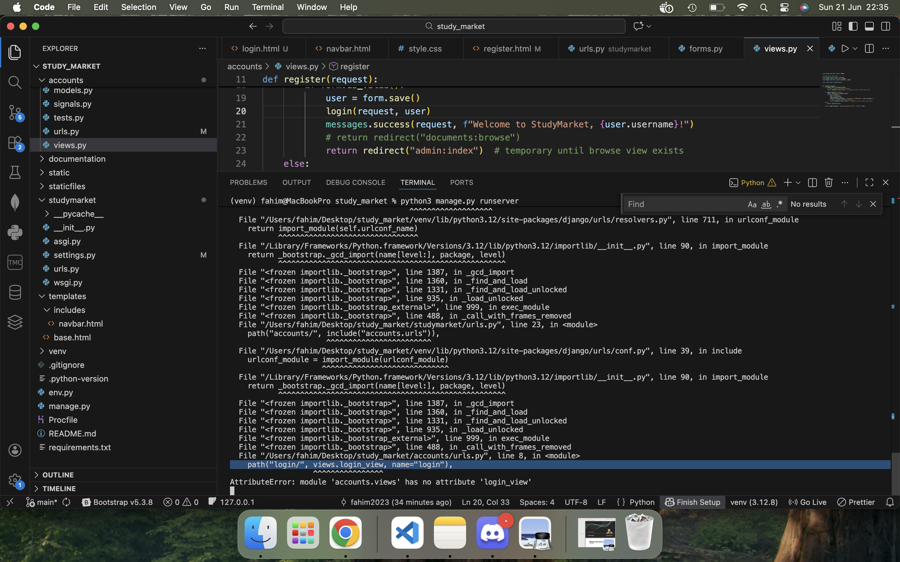

### Bug 6 — Custom CSS not applying: missing STATICFILES_DIRS

- **Issue:** The site rendered with default Bootstrap colours instead of the custom teal/orange design system palette defined in `static/css/style.css`, even though Bootstrap itself loaded correctly and `style.css` had the right content.
- **Root cause:** `STATICFILES_DIRS` was missing from `settings.py`. `STATIC_ROOT` only defines where `collectstatic` _outputs_ files for production — it does not tell Django where to _find_ source static files during development. Without `STATICFILES_DIRS` pointing at the project's `static/` folder, Django had no way to locate `style.css` at all, confirmed by `python manage.py findstatic css/style.css` returning "No matching file found."
- **Fix:** Added `STATICFILES_DIRS = [BASE_DIR / "static"]` to `settings.py`, alongside the existing `STATIC_URL` and `STATIC_ROOT` settings.
  **Before:**

```python
STATIC_URL = "static/"
STATIC_ROOT = BASE_DIR / "staticfiles"
```

**After:**

```python
STATIC_URL = "static/"
STATICFILES_DIRS = [BASE_DIR / "static"]
STATIC_ROOT = BASE_DIR / "staticfiles"
```

```bash
python manage.py findstatic css/style.css
python manage.py check
git add studymarket/settings.py
git commit -m "Fix missing STATICFILES_DIRS so custom CSS is found"
git push origin main
git push heroku main
```

- **Before:** 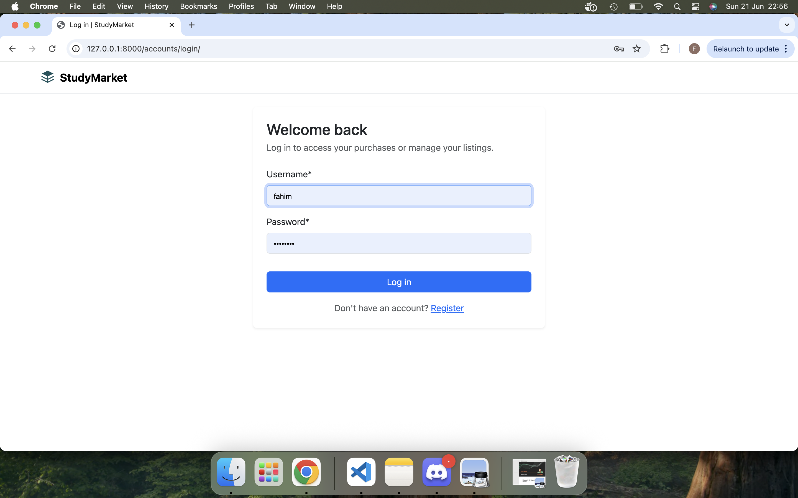
- **After:** 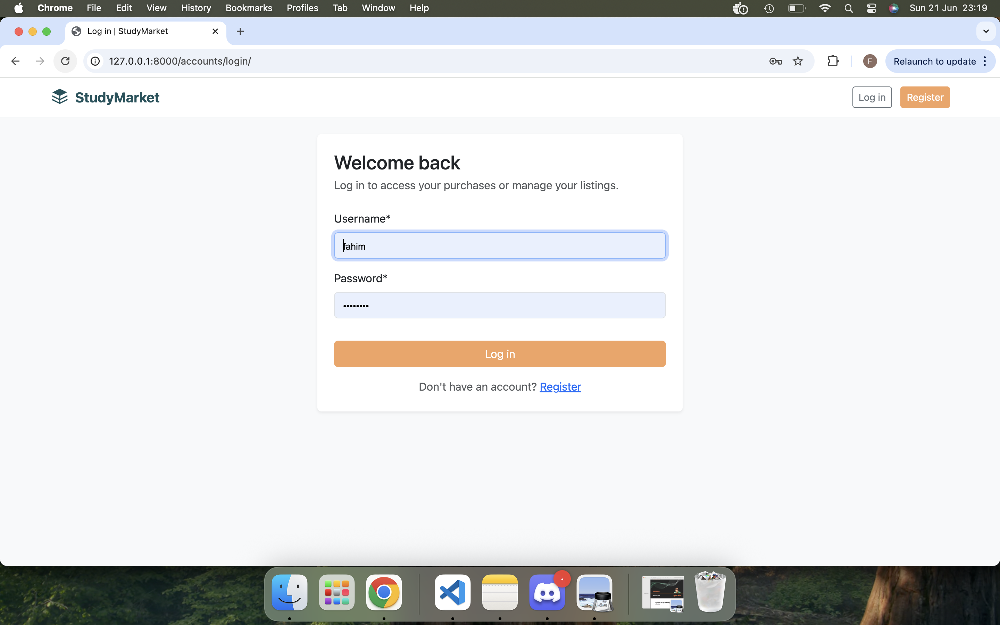

### Bug 7 — InvalidStorageError: missing 'default' key in STORAGES

- **Issue:** Attempting to save a `Document` with a file upload in Django admin crashed with `django.core.files.storage.handler.InvalidStorageError: Could not find config for 'default' in settings.STORAGES`.
- **Root cause:** The `STORAGES` setting in `settings.py` only defined the `staticfiles` backend (for Whitenoise), but Django's `FileField` on the `Document` model also requires a `default` backend to know where to store uploaded media files. Without it, any attempt to save a file upload crashes immediately.
- **Note:** This was also the likely root cause of the unexplained 500 error on `/accounts/login/` in production — the missing `default` storage key would crash any page rendering a file field, even just displaying a form.
- **Fix:** Added the `default` key to `STORAGES` and confirmed `MEDIA_URL` and `MEDIA_ROOT` were set correctly.

**Before (`settings.py`):**

```python
STORAGES = {
    "staticfiles": {
        "BACKEND": "whitenoise.storage.CompressedManifestStaticFilesStorage",
    },
}
```

**After (`settings.py`):**

```python
STORAGES = {
    "default": {
        "BACKEND": "django.core.files.storage.FileSystemStorage",
    },
    "staticfiles": {
        "BACKEND": "whitenoise.storage.CompressedManifestStaticFilesStorage",
    },
}
```

- **Before:** 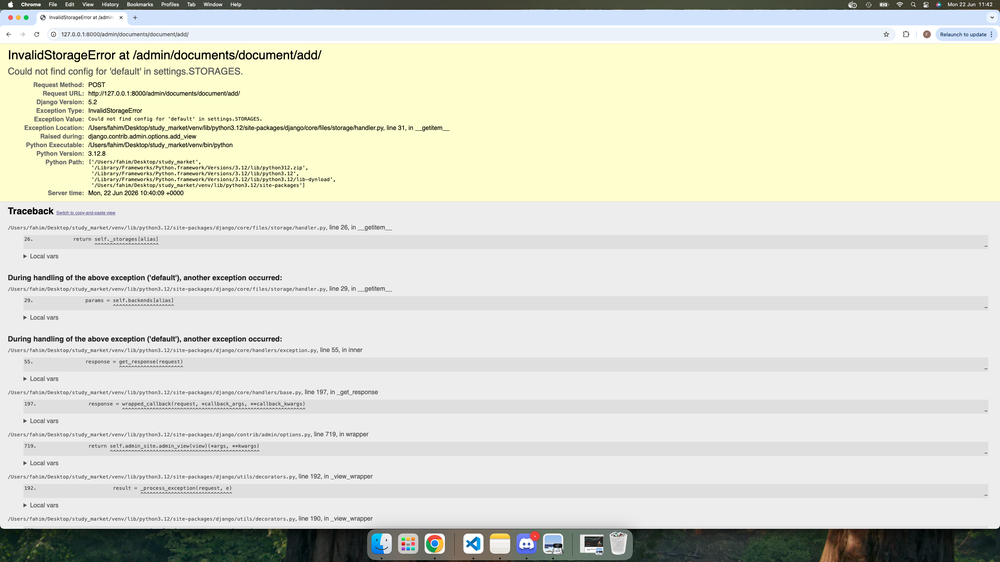
- **After:** 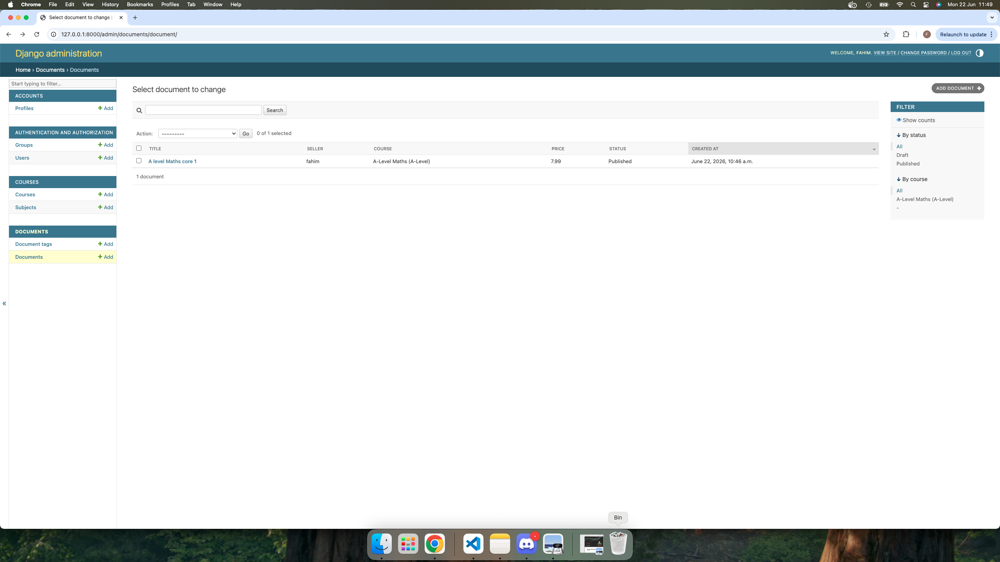

### Bug 8: `` placed before `` in checkout template

**Issue:** `TemplateSyntaxError` at `/payments/checkout/242/` when navigating to the checkout page. Django threw the error: ` must be the first tag in 'payments/checkout.html'`, preventing the page from rendering entirely.

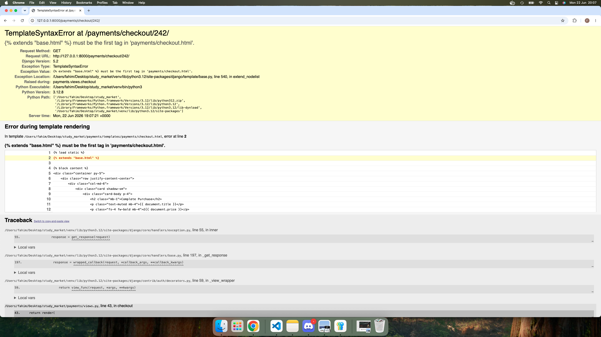

**Cause:** When separating the Stripe JavaScript into a static file, `` was added to the top of `checkout.html` on line 1, pushing `` down to line 2. Django's template engine requires `` to be the absolute first tag in any template that inherits from a base template — nothing can precede it, including `` tags.

**Fix:** Swapped the order so `` appears on line 1 and `` appears on line 2. Django processes `` before anything else, so `` works correctly when placed after it.

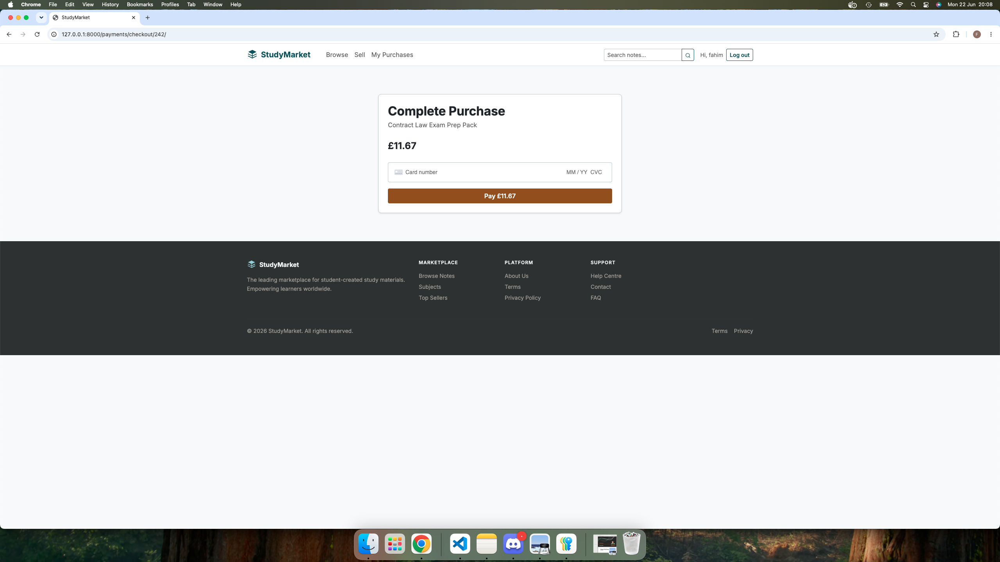

### Bug 9: Footer not sticking to bottom of page on short pages

**Issue:** On pages with little content such as the checkout page, the footer floated halfway up the screen leaving a large blank gap below it.


**Cause:** The `body` element had no minimum height set, so on pages where the content didn't fill the viewport, the footer would render immediately after the content rather than at the bottom of the page.

**Fix:** Added `min-height: 100vh` and `display: flex; flex-direction: column` to the `body` in `style.css`, and `flex: 1` to the `main` element. This forces the main content area to expand and fill all available space, pushing the footer to the bottom regardless of content length.

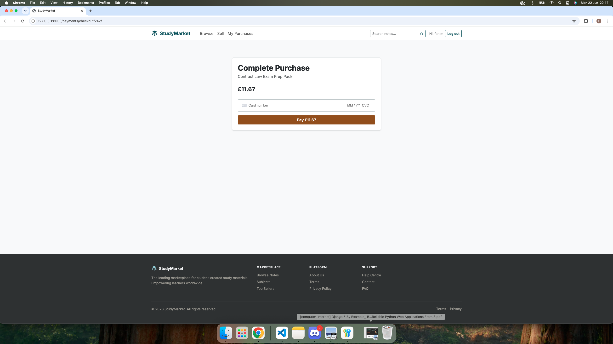

_(Each bug: issue, fix, before/after code, screenshot — added as they're hit and resolved.)_

---

## Future Implementations

- ***

## Credits

### Content

### Media

### Design Tools

### Code

_(Attribution for any external tutorials, docs, or library references used — required by the assignment spec.)_

### Tools & Platforms

### Acknowledgements
